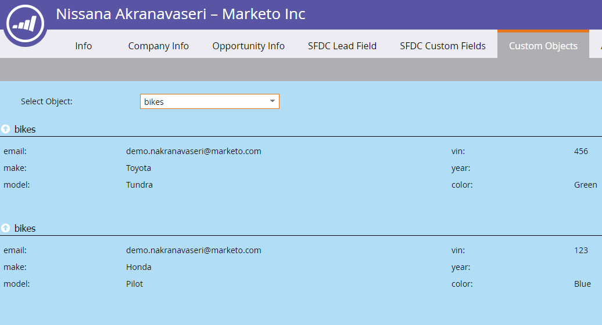

# Informazioni sugli oggetti personalizzati Marketo {#understanding-marketo-custom-objects}

Utilizzare oggetti personalizzati per tenere traccia delle metriche specifiche della propria attività.

>[!NOTE]
>
>**Disponibilità**
>
>Non tutti i clienti hanno acquistato questa funzionalità. Per informazioni, contattate il rappresentante commerciale.

Utilizza oggetti personalizzati come filtri e attivatori nelle campagne smart. Ad esempio:

* **Filtro**: Invia e-mail solo ai proprietari di un marchio specifico
* **Trigger**: Invia un messaggio e-mail quando un oggetto personalizzato viene aggiunto a una persona o società.

È possibile impostare oggetti personalizzati in una relazione uno-a-molti o molti-a-molti. Ad esempio:

* **Uno-a-molti**: Una persona possiede diverse auto
* **Molti-a-molti**: Più studenti iscritti a più corsi da un catalogo corsi

Una struttura uno-molti utilizza un singolo campo di collegamento per collegare l&#39;oggetto personalizzato a una persona o a una società.

Gli oggetti personalizzati molti-molti utilizzano due campi di collegamento, parte di un oggetto intermediario. Un campo Collegamento è collegato alla persona o alla società e un altro all’oggetto personalizzato, ad esempio il catalogo del corso. Questo oggetto intermedio può contenere campi personalizzati aggiuntivi, ad esempio un livello del corso o una data di partecipazione, che definiscono ulteriormente la natura della connessione.

>[!TIP]
>
>Importa oggetti personalizzati utilizzando valori separati da virgola (CSV) nell&#39;interfaccia utente per verificare e convalidare un esempio di dati. Quindi caricate tutti i file con un&#39;API.

>[!CAUTION]
>
>Non è possibile ripristinare gli oggetti personalizzati, quindi accertarsi di non averne più bisogno prima di eliminarli.

## Accesso agli oggetti personalizzati Marketo {#accessing-marketo-custom-objects}

1. Per creare o modificare oggetti personalizzati Marketo, fare clic su **Admin **e quindi sul collegamento **Marketo Custom** Objects (Oggetti personalizzati Marketo).

   

1. La visualizzazione Oggetti personalizzati Marketo elenca tutti gli oggetti personalizzati sulla destra, ma solo quelli approvati nella griglia principale.

   

1. La griglia visualizza il nome dell&#39;oggetto, il numero di record, il numero di campi e la data dell&#39;aggiornamento più recente.

   >[!TIP]
   >
   >Marketo aggiorna automaticamente questi campi, ma è possibile aggiornare la visualizzazione facendo clic sull&#39;icona nella colonna Record.

1. Fate clic sul nome dell’oggetto a destra per aprire la pagina dei dettagli.

   

## Visualizza oggetti personalizzati associati a una persona {#view-custom-objects-associated-to-a-person}

Dopo aver creato la struttura dell&#39;oggetto personalizzato, quando si caricano i dati specifici dell&#39;oggetto personalizzato, gli oggetti personalizzati vengono automaticamente associati alle persone presenti nel database utilizzando il campo del collegamento nell&#39;oggetto personalizzato. È possibile visualizzare informazioni dalla scheda Oggetti personalizzati nella pagina dei dettagli della persona.

1. Vai a **Database**.

   

1. Aprite il database e fate clic sulla scheda **Persone** . Fare doppio clic sul record per la persona associata a un oggetto personalizzato.

   

1. Nella pagina dei dettagli della persona, fare clic sulla scheda Oggetti **** personalizzati. Selezionare l&#39;oggetto dall&#39;elenco a discesa.

   

1. Ora è possibile visualizzare un elenco di tutti gli oggetti personalizzati di quel tipo associati a tale persona.

   

## Utilizzo di oggetti personalizzati con le aziende {#using-custom-objects-with-companies}

Un oggetto personalizzato collegato alla società funziona meglio se si sincronizzano società da CRM o se si creano società in modo esplicito utilizzando l&#39;API. È inoltre consigliabile utilizzare l&#39;ID società come campo di collegamento.

Se hai più persone in Marketo che sono record nei record CRM o Marketo, un oggetto personalizzato collegato a una società non verrà associato a più di un record singolo. Ciò è dovuto al fatto che una società con più persone al di sotto di essa è supportata solo quando le società vengono sincronizzate dal CRM o se si utilizza un&#39;API per creare esplicitamente società.

Gli oggetti personalizzati possono collegarsi direttamente a un singolo record. Ciò significa che quando il tipo di oggetto personalizzato è collegato per campo società, è necessario assicurarsi che i record di persona siano associati a una società utilizzando la conversione dei contatti in CRM, oppure utilizzando il campo externalCompanyId, se si gestiscono società utilizzando le API REST di Marketo. Per i record di persona che non sono collegati esplicitamente ai record aziendali, gli oggetti personalizzati collegati tramite la società saranno collegati in modo casuale a un singolo record, anche se il valore del campo della società viene condiviso tra più persone.

Per ulteriori informazioni, vedere [Importare dati](import-custom-object-data.md) oggetto personalizzati.

>[!MORELIKETHIS]
>
>* [Creare oggetti personalizzati Marketo](create-marketo-custom-objects.md)
>* [Approvare un oggetto personalizzato](approve-a-custom-object.md)
>* [Modifica ed eliminazione di un oggetto personalizzato Marketo](edit-and-delete-a-marketo-custom-object.md)
>* [Aggiungi campi oggetto personalizzati Marketo](add-marketo-custom-object-fields.md)
>* [Modifica ed eliminazione dei campi oggetto personalizzati Marketo](edit-and-delete-marketo-custom-object-fields.md)
>* [Importa dati oggetto personalizzati](import-custom-object-data.md)

>

