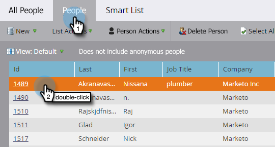

# Informazioni sugli oggetti personalizzati di Marketo {#understanding-marketo-custom-objects}

Utilizza oggetti personalizzati per tenere traccia delle metriche specifiche della tua azienda.

>[!AVAILABILITY]
>
>Questa funzionalità non è stata acquistata da tutti i clienti. Per ulteriori informazioni, contatta il tuo rappresentante commerciale.

Utilizza oggetti personalizzati come filtri e attivatori nelle campagne intelligenti. Ad esempio:

* **Filtro**: invia e-mail solo ai proprietari di una marca di veicolo specifica
* **Trigger**: invia un’e-mail quando un oggetto personalizzato viene aggiunto a una persona o a un’azienda.

È possibile impostare oggetti personalizzati in una relazione uno-a-molti o molti-a-molti. Ad esempio:

* **Uno-a-molti**: una persona possiede diverse auto
* **Molti-a-molti**: più studenti sono iscritti a più corsi da un catalogo dei corsi

Una struttura uno-a-molti utilizza un singolo campo di collegamento per collegare l’oggetto personalizzato a una persona o a un’azienda.

Gli oggetti personalizzati &quot;da molti a molti&quot; utilizzano due campi di collegamento, parte di un oggetto intermedio. Un campo Collegamento è connesso alla persona o all’azienda e un altro all’oggetto personalizzato, ad esempio il catalogo dei corsi. Questo oggetto intermedio può contenere campi personalizzati aggiuntivi, ad esempio un livello di corso o una data di partecipazione, che definiscono ulteriormente la natura della connessione.

>[!TIP]
>
>Importa oggetti personalizzati utilizzando valori delimitati da virgole (CSV) all’interno dell’interfaccia utente per testare e convalidare un esempio di dati. Quindi, carica tutti i file con un’API.

>[!CAUTION]
>
>Non è possibile ripristinare oggetti personalizzati, quindi assicurati di non averne più bisogno prima di eliminarli.

## Accesso agli oggetti personalizzati di Marketo {#accessing-marketo-custom-objects}

1. Vai a **[!UICONTROL Amministratore]** area.

   

1. Clic **[!UICONTROL Oggetti personalizzati Marketo]**.

   

1. Nella visualizzazione Oggetti personalizzati di Marketo sono elencati a destra tutti gli oggetti personalizzati, ma solo quelli approvati nella griglia principale.

   

   >[!NOTE]
   >
   >Nella griglia vengono visualizzati il nome dell&#39;oggetto, il numero di record, il numero di campi e la data dell&#39;aggiornamento più recente.

   >[!TIP]
   >
   >Marketo aggiorna questi campi automaticamente, ma puoi aggiornare la visualizzazione facendo clic sull’icona nella colonna Record.

1. Fare clic sul nome dell&#39;oggetto a destra per aprire la pagina dei dettagli.

   

## Visualizzare oggetti personalizzati associati a una persona {#view-custom-objects-associated-to-a-person}

Dopo aver creato la struttura oggetto personalizzata, quando si caricano dati oggetto personalizzati specifici, gli oggetti personalizzati vengono automaticamente associati agli utenti del database utilizzando il campo di collegamento nell&#39;oggetto personalizzato. È possibile visualizzare le informazioni da [!UICONTROL Oggetti personalizzati] nella pagina dettagli persona.

1. Vai a **[!UICONTROL Database]**.

   

1. Aprire il database e fare clic su **[!UICONTROL Persone]** scheda. Fare doppio clic sul record di una persona associata a un oggetto personalizzato.

   

1. Nella pagina dei dettagli della persona, fai clic su **[!UICONTROL Oggetti personalizzati]** scheda. Seleziona l’oggetto dal menu a discesa.

   

1. Ora puoi visualizzare un elenco di tutti gli oggetti personalizzati di quel tipo associati a quella persona.

   

## Utilizzo di oggetti personalizzati con le aziende {#using-custom-objects-with-companies}

Un oggetto personalizzato collegato all’azienda funziona meglio se sincronizzi le aziende dal sistema di gestione delle relazioni con i clienti o se crei esplicitamente aziende utilizzando l’API. È inoltre consigliabile utilizzare l’ID azienda come campo di collegamento.

Se in Marketo sono presenti più persone che sono record nei record CRM o solo Marketo, un oggetto personalizzato collegato a un&#39;azienda non verrà associato a più di un singolo record. Questo perché una società con più persone al di sotto di essa è supportata solo quando le società vengono sincronizzate dal sistema di gestione delle relazioni con i clienti o se utilizzi un’API per creare esplicitamente le società.

Gli oggetti personalizzati possono essere collegati direttamente solo a un singolo record. Ciò significa che quando il tipo di oggetto personalizzato è collegato dal campo aziendale, devi assicurarti che i record delle persone siano associati a una società utilizzando la conversione dei contatti nel CRM oppure utilizzando il campo externalCompanyId, se gestisci aziende utilizzando le API REST di Marketo. Per i record persona che non sono collegati in modo esplicito ai record società, gli oggetti personalizzati collegati tramite azienda verranno collegati in modo casuale a un singolo record, anche se il valore del campo società è condiviso tra più persone.

Consulta [Importa dati oggetto personalizzati](/help/marketo/product-docs/administration/marketo-custom-objects/import-custom-object-data.md) per ulteriori informazioni.

>[!MORELIKETHIS]
>
>* [Creare oggetti personalizzati di Marketo](/help/marketo/product-docs/administration/marketo-custom-objects/create-marketo-custom-objects.md)
>* [Approvare un oggetto personalizzato](/help/marketo/product-docs/administration/marketo-custom-objects/approve-a-custom-object.md)
>* [Modificare ed eliminare un oggetto personalizzato di Marketo](/help/marketo/product-docs/administration/marketo-custom-objects/edit-and-delete-a-marketo-custom-object.md)
>* [Aggiungi campi oggetto personalizzati Marketo](/help/marketo/product-docs/administration/marketo-custom-objects/add-marketo-custom-object-fields.md)
>* [Modificare ed eliminare i campi oggetto personalizzati di Marketo](/help/marketo/product-docs/administration/marketo-custom-objects/edit-and-delete-marketo-custom-object-fields.md)
>* [Importa dati oggetto personalizzati](/help/marketo/product-docs/administration/marketo-custom-objects/import-custom-object-data.md)

