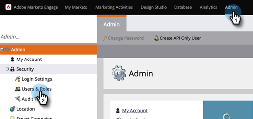

# Aggiungi utente solo API per le sottoscrizioni abilitate Adobe IMS {#add-api-only-user-for-adobe-ims-enabled-subscriptions}

Gli utenti e gli amministratori di Marketi Engage Marketing vengono gestiti in Adobe Admin Console, mentre gli utenti di Marketi Engage API Only devono essere creati e gestiti in Marketi Engage.

I passaggi seguenti descrivono come aggiungere un utente solo API nel Marketo Engage. Prima di procedere, è necessario disporre di [ha stabilito un ruolo solo API](/help/marketo/product-docs/administration/users-and-roles/create-an-api-only-user-role.md).

1. In Marketo, fai clic su **[!UICONTROL Amministratore]** e seleziona **[!UICONTROL Utenti e ruoli]**.

   

1. Clic **[!UICONTROL Crea utente solo API]**.

   

1. Immetti un [!UICONTROL E-mail], [!UICONTROL Nome], e [!UICONTROL Cognome] solo per l’utente API. Seleziona la [!UICONTROL Solo API] Ruolo che desideri assegnare all’utente. Clic **[!UICONTROL Crea utente solo API]** al termine.

   

>[!NOTE]
>
>Quando l’azione ha esito positivo, la finestra modale Crea solo utente API si chiude e l’elenco Utenti si aggiorna e il nuovo utente è visibile.
