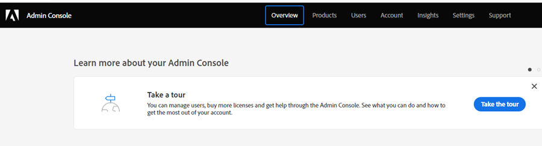

# Aggiungere o rimuovere un amministratore di prodotto {#add-or-remove-a-product-admin}

>[!NOTE]
>
>**Sistema** Gli amministratori vengono creati solo a livello di organizzazione Adobe. Se pensi di averne più di uno, contatta [Supporto Marketo](https://nation.marketo.com/t5/support/ct-p/Support).

## Aggiungi un amministratore di prodotto {#add-a-product-admin}

1. Accedi a [Adobe Admin Console](https://adminconsole.adobe.com/).

   

1. Fai clic su **Marketo Engage**.

   

1. Seleziona l’abbonamento desiderato (se ne hai più di uno).

   

1. Fai clic sul pulsante **Amministratori** scheda .

   

1. Fai clic sul pulsante **Aggiungi amministratore** pulsante .

   

1. Immetti l’indirizzo e-mail o il nome utente dell’amministratore da aggiungere. Il nome e il cognome sono facoltativi. Fai clic su **Salva**.

   

1. Fai clic sul nome dell’amministratore appena aggiunto.

   

1. In Prodotti, fai clic sul menu a tre punti e seleziona **Modifica**.

   

1. Fai clic sul pulsante **+** segno. Fai clic sulla freccia accanto all’abbonamento al Marketo Engage desiderato (se ce ne sono più di uno) e seleziona il profilo di prodotto desiderato.

   

1. Fai clic su **Salva**.

   

L’utente riceverà quindi due e-mail. La prima e-mail li notifica di aver ricevuto i diritti di amministratore prodotto al Marketo Engage. La seconda e-mail li invita ad accedere al Marketo Engage.

>[!NOTE]
>
>Quando l’utente amministratore del prodotto viene aggiunto al Marketo Engage tramite Adobe Admin Console, all’utente viene assegnato il ruolo di amministratore del prodotto di Adobe all’interno dell’abbonamento.

## Rimuovere un amministratore {#remove-a-user}

1. Accedi a [Adobe Admin Console](https://adminconsole.adobe.com/).

   

1. Fai clic su **Marketo Engage**.

   

1. Seleziona l’abbonamento desiderato (se ne hai più di uno).

   

1. Fai clic sul pulsante **Amministratori** scheda .

   

1. Seleziona l’amministratore da rimuovere e fai clic sul pulsante **Rimuovi amministratore** pulsante .

   

1. Fai clic su **Rimuovi amministratore** per confermare.

   

L’utente riceverà quindi un’e-mail di notifica per informarlo che non ha più accesso al Marketo Engage da parte dell’amministratore di prodotto.
