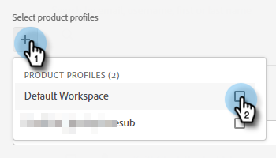

# Aggiungere o rimuovere un utente {#add-or-remove-a-user}

## Aggiungi un utente {#add-a-user}

1. Accedi a [Adobe Admin Console](https://adminconsole.adobe.com/){target="_blank"}.

   

1. Clic **Marketo Engage**.

   

1. Seleziona la sottoscrizione desiderata (se ne hai più di una).

   

1. Fai clic su **[!UICONTROL Utenti]** scheda.

   

1. Fai clic su **[!UICONTROL Aggiungi utente]** pulsante.

   

1. Immetti il nome, il gruppo di utenti o l’indirizzo e-mail dell’utente che desideri aggiungere. Nome e cognome sono facoltativi.

   

1. Fai clic su **+** e seleziona il profilo di prodotto desiderato.

   

   >[!IMPORTANT]
   >
   >Un utente _deve_ essere aggiunto a un profilo di prodotto per accedere al Marketo Engage.

1. Clic **[!UICONTROL Salva]**.

   

L’utente riceverà quindi un’e-mail per accedere al Marketo Engage.

>[!NOTE]
>
>Quando l’utente viene aggiunto al Marketo Engage tramite Adobe Admin Console, gli viene concesso il ruolo &quot;Utente standard&quot; nell’area di lavoro predefinita dell’abbonamento. Se il ruolo dell’utente all’interno dell’area di lavoro deve essere regolato, ciò viene eseguito in Marketo Engage, [come descritto qui](/help/marketo/product-docs/administration/users-and-roles/managing-user-roles-and-permissions.md){target="_blank"}.

## Rimuovi un utente {#remove-a-user}

1. Accedi a [Adobe Admin Console](https://adminconsole.adobe.com/){target="_blank"}.

   

1. Clic **Marketo Engage**.

   

1. Seleziona la sottoscrizione desiderata (se ne hai più di una).

   

1. Fai clic su **[!UICONTROL Utenti]** scheda.

   

1. Seleziona l’utente da rimuovere e fai clic su **[!UICONTROL Rimuovi]** pulsante.

   

1. Clic **[!UICONTROL Rimuovi utente]** per confermare.

   

L’utente riceverà quindi un’e-mail di notifica per informare che non ha più accesso al Marketo Engage.

>[!MORELIKETHIS]
>
>* [Utenti Adobe Admin Console](https://helpx.adobe.com/enterprise/using/users.html){target="_blank"}
>* [Gestisci Singolarmente Gli Utenti](https://helpx.adobe.com/enterprise/using/manage-users-individually.html){target="_blank"}
