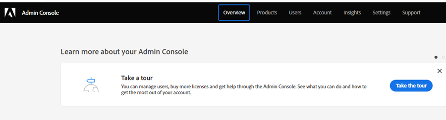
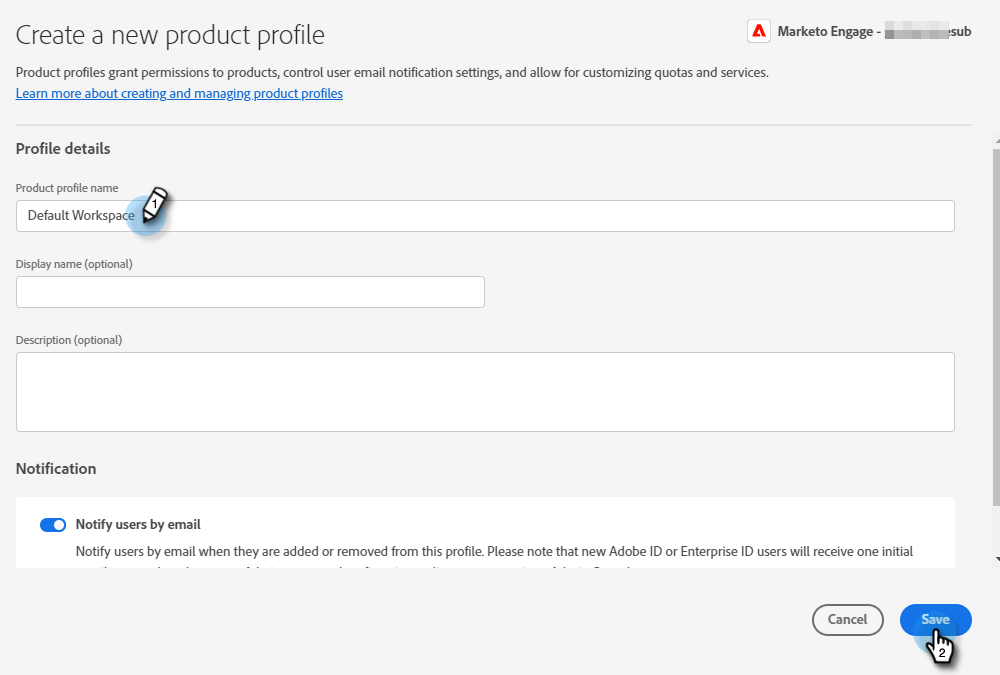

# Configurazione dell’amministratore {#admin-setup}

Dopo essere stato aggiunto come amministratore di sistema di Adobe a Marketo Engage in un’organizzazione Adobe, dovrai eseguire alcuni passaggi per completare la configurazione iniziale.

## Configurazione iniziale {#initial-setup}

1. Dopo essere stato aggiunto come Amministratore di sistema designato per Marketo Engage (in un’organizzazione nuova o consolidata), riceverai un’e-mail di benvenuto. Nell&#39;e-mail, fare clic su **[!UICONTROL Get Started]**.

   

1. Se in precedenza hai effettuato l’accesso a un’applicazione con un Adobe ID, accedi direttamente a Adobe Admin Console. In caso contrario, [configura il tuo Adobe ID](https://helpx.adobe.com/manage-account/using/create-update-adobe-id.html){target="_blank"}.

   

## Creare un Profilo prodotto {#create-a-product-profile}

Una volta che l’amministratore di sistema avrà effettuato l’accesso ad Admin Console, sarà possibile creare un profilo di prodotto. In questo modo gli utenti/amministratori possono accedere a Marketo Engage.

1. Nella pagina **[!UICONTROL Overview]**, in **[!UICONTROL Products and Services]**, fare clic su **Marketo Engage**.

   

1. Scegli l’abbonamento desiderato. Se ne hai solo uno, passa al passaggio successivo.

   

   >[!NOTE]
   >
   >Se hai più abbonamenti, segui questi passaggi per ciascuno di essi.

1. Fare clic sul pulsante **[!UICONTROL New Profile]**.

   

1. Assegna un nome al profilo di prodotto (il nome visualizzato e la descrizione sono facoltativi) e fai clic su **[!UICONTROL Next]**.

   

1. Non è necessario selezionare alcun servizio. Fai clic su **[!UICONTROL Save]**.

>[!NOTE]
>
>Se imposti più profili di prodotto, gli utenti avranno lo stesso accesso a Marketo, indipendentemente dal profilo a cui vengono aggiunti.

>[!MORELIKETHIS]
>
>[Aggiungi o rimuovi amministratore prodotto](/help/marketo/product-docs/administration/users-and-roles/add-or-remove-a-product-admin.md){target="_blank"}
