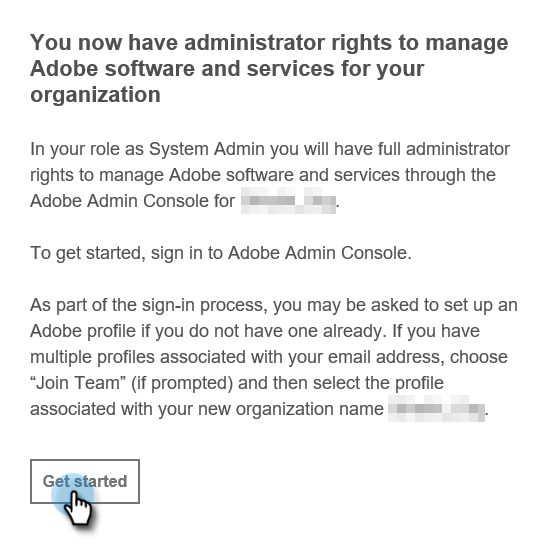

# Configurazione amministratore {#admin-setup}

Una volta aggiunto come amministratore di sistema di Marketo a un’organizzazione di Adobe, dovrai seguire alcuni passaggi per completare la configurazione iniziale.

## Configurazione amministratore di sistema {#system-admin-setup}

1. Una volta stabilita l’organizzazione di Adobe, l’amministratore di sistema designato riceverà un’e-mail di benvenuto. In quell&#39;e-mail, fai clic su **Inizia**.

   

1. Se in precedenza hai effettuato l’accesso a un’applicazione con un Adobe ID, verrai reindirizzato direttamente a Adobe Admin Console. In caso contrario, [configura il tuo Adobe ID](https://helpx.adobe.com/manage-account/using/create-update-adobe-id.html).

   

## Creare un profilo di prodotto {#create-a-product-profile}

Dopo che l’amministratore di sistema accede all’Admin Console, è ora di creare un profilo di prodotto.

1. In Prodotti e servizi fare clic su **Marketo Engage**.

   

1. Scegli l’abbonamento desiderato. Se ne hai solo uno, passa al passaggio successivo.

   

   >[!NOTE]
   >
   >Se disponi di più abbonamenti, questi passaggi devono essere seguiti per ciascuno di essi.

1. Fai clic sul pulsante **Nuovo profilo** .

   

1. Assegna un nome al profilo di prodotto (Nome visualizzato e Descrizione opzionali) e fai clic su **Salva**.

   

>[!NOTE]
>
>Se imposti più profili di prodotto, gli utenti avranno lo stesso accesso a Marketo, indipendentemente dal profilo a cui saranno aggiunti.

## Configurazione dell’amministratore del prodotto {#product-admin-setup}

1. Dopo essere stato invitato da un amministratore di sistema, riceverai un’e-mail di benvenuto. In quell&#39;e-mail, fai clic su **Inizia**.

   

1. Se in precedenza hai effettuato l’accesso a un’applicazione con un Adobe ID, verrai reindirizzato direttamente a Adobe Admin Console. In caso contrario, [configura il tuo Adobe ID](https://helpx.adobe.com/manage-account/using/create-update-adobe-id.html).

   

È così semplice! Gli amministratori di prodotto sono responsabili principalmente dell’aggiunta di utenti. [Scopri come farlo qui](/help/marketo/product-docs/administration/marketo-with-adobe-identity/add-or-remove-a-user.md#add-a-user).

>[!MORELIKETHIS]
>
>[Aggiungere o rimuovere un amministratore di prodotto](/help/marketo/product-docs/administration/marketo-with-adobe-identity/add-or-remove-a-product-admin.md)
