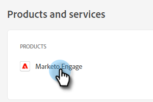

# Configurazione amministratore {#admin-setup}

Dopo essere stato aggiunto come amministratore di sistema di Adobe al Marketo Engage in un’organizzazione di Adobe, dovrai eseguire alcuni passaggi per completare la configurazione iniziale.

## Configurazione iniziale {#initial-setup}

1. Dopo essere stato aggiunto come Amministratore di sistema designato per il Marketo Engage (in un’organizzazione nuova o stabilita), riceverai un’e-mail di benvenuto. Nell’e-mail, fai clic su **[!UICONTROL Introduzione]**.

   

1. Se in precedenza hai effettuato l’accesso a un’applicazione con un Adobe ID, accedi direttamente a Adobe Admin Console. In caso contrario, [configurare l’Adobe ID](https://helpx.adobe.com/manage-account/using/create-update-adobe-id.html){target="_blank"}.

   

## Creare un profilo di prodotto {#create-a-product-profile}

Dopo che l’amministratore di sistema avrà effettuato l’accesso all’Admin Console, è ora di creare un profilo di prodotto. In questo modo gli utenti/amministratori possono accedere al Marketo Engage.

1. In **[!UICONTROL Panoramica]** pagina, sotto **[!UICONTROL Prodotti e servizi]**, fai clic su **Marketo Engage**.

   

1. Scegli l’abbonamento desiderato. Se ne hai solo uno, passa al passaggio successivo.

   

   >[!NOTE]
   >
   >Se hai più abbonamenti, segui questi passaggi per ciascuno di essi.

1. Fai clic su **[!UICONTROL Nuovo profilo]** pulsante.

   

1. Assegna un nome al profilo di prodotto (il nome visualizzato e la descrizione sono facoltativi) e fai clic su **[!UICONTROL Salva]**.

   

>[!NOTE]
>
>Se imposti più profili di prodotto, gli utenti avranno lo stesso accesso a Marketo, indipendentemente dal profilo a cui vengono aggiunti.

>[!MORELIKETHIS]
>
>[Aggiungere o rimuovere un amministratore di prodotto](/help/marketo/product-docs/administration/marketo-with-adobe-identity/add-or-remove-a-product-admin.md){target="_blank"}
