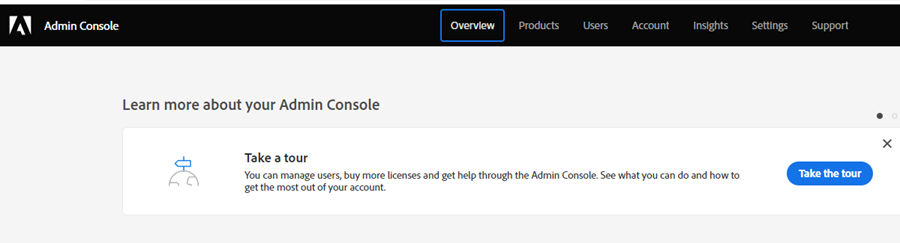

# Configurazione dell’amministratore di prodotto {#product-admin-setup}

1. Dopo essere stato invitato da un amministratore di sistema, riceverai un’e-mail di benvenuto. Nell’e-mail, fai clic su **[!UICONTROL Introduzione]**.

   

1. Se in precedenza hai effettuato l’accesso a un’applicazione con un Adobe ID, accedi direttamente a Adobe Admin Console. In caso contrario, [configurare l’Adobe ID](https://helpx.adobe.com/manage-account/using/create-update-adobe-id.html){target="_blank"}.

   

È così semplice! Gli amministratori di prodotto sono i principali responsabili dell’aggiunta degli utenti. [Scopri come farlo qui](/help/marketo/product-docs/administration/marketo-with-adobe-identity/add-or-remove-a-user.md#add-a-user){target="_blank"}.
