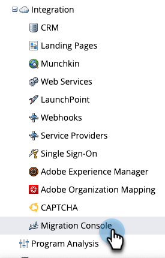
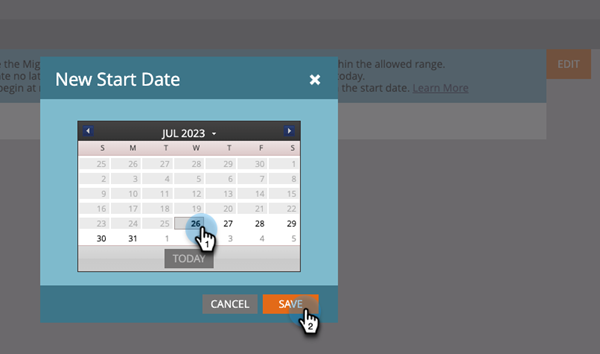
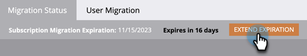
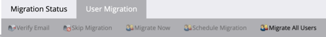
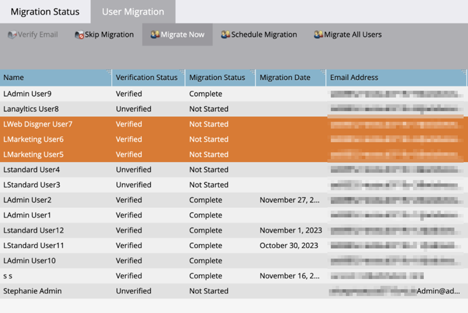
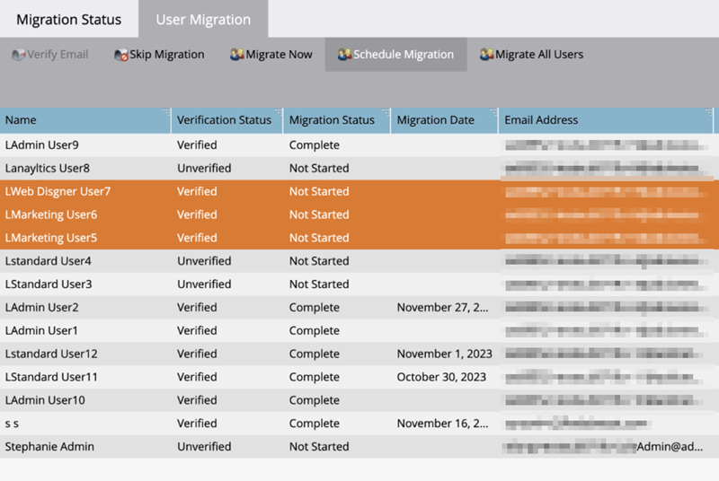
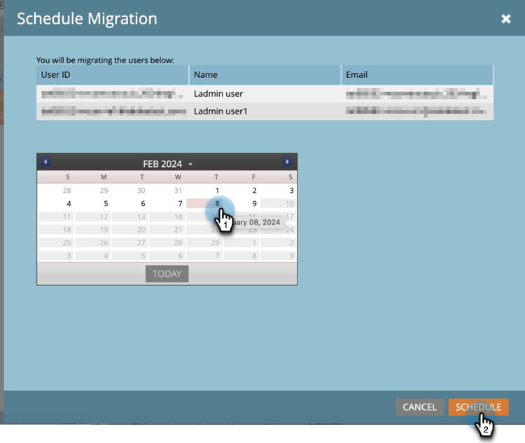

# Migrazione ad Adobe Identity {#migrating-to-adobe-identity}

Quando Adobe pianifica la migrazione degli utenti di un abbonamento, gli amministratori di prodotto di Marketo Engage avranno accesso alla console di migrazione, disponibile nel menu di navigazione nell’area di amministrazione nella sezione Integrazione.

## Pre-migrazione {#pre-migration}

Prima dell’inizio della migrazione, un amministratore può modificare la data di inizio della migrazione degli utenti per il proprio abbonamento accedendo alla schermata Pre-migrazione nella console di migrazione. Per cambiare la data, l’amministratore può fare clic sul pulsante **Modifica**.

L’amministratore può scegliere una data compresa tra gli 8 e i 30 giorni successivi. Quando viene selezionata una data, l’amministratore deve fare clic su **Salva** per apportare la modifica.

>[!NOTE]
>
>Per richiedere una data antecedente a 8 giorni o successiva a 30, o se devi modificare la data dopo il blocco della console di pre-migrazione, invia un’e-mail all’indirizzo `marketocares@marketo.com`.

## Migrazioni ad Adobe Identity {#migrations-to-adobe-identity}

Tutti gli abbonamenti Marketo con fuso orario degli Stati Uniti verranno migrati a partire dalla mezzanotte, ora standard del Pacifico, della data di inizio della migrazione degli utenti. La migrazione degli utenti per tutti gli altri abbonamenti inizierà alla mezzanotte nel fuso orario specificato per l’abbonamento. Quando inizia la migrazione degli utenti di un abbonamento, la gestione degli utenti non sarà più disponibile nell’area di amministrazione di Marketo e potrà solo essere effettuata in Adobe Admin Console. La gestione dei ruoli rimane nella scheda Utenti e ruoli dell’area di amministrazione di Marketo, nonché nella gestione locale degli utenti (solo API).

Adobe eseguirà prima la migrazione automatica di tutti gli amministratori di Marketo (con un ruolo di amministratore standard) con e-mail verificate. Quando gli amministratori di Marketo vengono trasferiti ad Adobe Identity con il ruolo di amministratore di prodotto in Adobe Admin Console per l’abbonamento Marketo, viene assegnato loro il ruolo di amministratore di prodotto Adobe all’interno dell’applicazione Marketo (insieme a tutti gli altri eventuali ruoli che avevano in precedenza) e il loro Adobe ID sarà autorizzato per l’abbonamento. Gli amministratori riceveranno due e-mail. Una con l’indicazione dell’assegnazione come amministratore di prodotto Admin Console e l’altra con il relativo Adobe ID autorizzato per il prodotto Marketo.

>[!IMPORTANT]
>
>Per accedere a Marketo Engage con il tuo Adobe ID, devi fare clic sul pulsante **Accetta invito** nell’e-mail relativa alla licenza.

**E-mail per amministratore prodotto Marketo**

**E-mail relativa alla licenza Marketo**

**Se l’abbonamento a Marketo non dispone di SSO in Marketo e/o nell’organizzazione Adobe**, Adobe eseguirà la migrazione automatica degli altri utenti. Questo flusso di lavoro mira a fornire il massimo livello di automazione e non è necessaria alcuna azione per eseguire la migrazione. Al termine della migrazione, la console di migrazione di Marketo non verrà più visualizzata nell’area di navigazione di amministrazione di Marketo e tutti gli utenti accederanno a Marketo utilizzando un Adobe ID.

**Se l’abbonamento a Marketo dispone di SSO in Marketo e/o nell’organizzazione Adobe**, gli amministratori di Marketo avranno accesso allo strumento Self-Service User Migration della console di migrazione all’inizio della migrazione degli utenti e riceveranno un avviso tramite un banner al momento dell’accesso alla pagina My Marketo. L’amministratore sarà responsabile del completamento della migrazione degli utenti tramite lo strumento Self-Service User Migration.

## Self-Service User Migration di Marketo {#marketo-self-service-user-migration}

Lo strumento della console di Marketo Self-Service User Migration è costituito da due schede.

* **Scheda Stato della migrazione**
* **Scheda Migrazione degli utenti**

Per completare la migrazione self-service sono necessari tre passaggi principali.

1. Eseguire la migrazione di tutti gli utenti idonei desiderati con indirizzo e-mail verificato (scheda Migrazione utenti)
1. Escludere tutti gli utenti non idonei ed eventuali utenti idonei non desiderati (scheda Migrazione utenti)
1. Al termine dei passaggi 1 e 2, è necessario completare la conferma della migrazione (scheda Stato della migrazione).

### Scheda Stato della migrazione {#migration-status-tab}

La scheda Stato della migrazione fornisce metriche generali sull’avanzamento dei prerequisiti di verifica e-mail degli utenti, sulla migrazione e attivazione degli utenti e sul completamento della migrazione dell’abbonamento.

Nella parte superiore dello Stato di migrazione vengono visualizzati la scadenza della migrazione dell’abbonamento e il pulsante per estendere tale scadenza. Ulteriori informazioni sulla scadenza della migrazione sono disponibili nella [sezione Scadenza migrazione degli utenti](#user-migration-expiration).

Nella sezione successiva della scheda Stato di migrazione sono disponibili due barre di avanzamento. La prima barra di avanzamento mostra l’avanzamento del completamento della verifica e-mail degli utenti. La seconda barra di avanzamento mostra l’avanzamento del completamento della migrazione degli utenti.

Successivamente, l’amministratore visualizzerà tre sezioni dello Stato.

* **Verifica e-mail utente**: la verifica dello stato degli utenti all’interno dell’abbonamento.
* **Migrazione utenti e attivazione**: la migrazione utenti e lo stato di attivazione (migrazione e licenza per il prodotto Marketo Engage) degli utenti all’interno dell’abbonamento.
* **Conferma migrazione**: lo stato di completamento della migrazione dell’abbonamento.

#### Verifica e-mail utenti {#user-email-verification}

Nella sezione Verifica e-mail utenti, l’amministratore può consultare lo stato corrente della verifica e-mail per gli utenti dell’abbonamento, prima della migrazione ad Adobe Identity.

L’amministratore può visualizzare lo stato di verifica e-mail dell’abbonamento, la percentuale di utenti dell’abbonamento che hanno completato la verifica e-mail e il numero di utenti contrassegnati come esclusi. Lo stato sarà segnalato in base allo stato della verifica e-mail di tutti gli utenti dell’abbonamento. L’amministratore può fare clic sul numero di utenti esclusi e passerà alla scheda Migrazione utenti per visualizzarli.

L’amministratore può inviare nuovamente l’email di verifica nella schede Migrazione utenti della console di migrazione e nella scheda Utente e ruoli dell’area di amministrazione di Marketo, oppure per utente nelle Impostazioni account. Come per le e-mail di invito degli utenti, il collegamento contenuto nell’e-mail di verifica scade dopo 3 giorni. Ulteriori informazioni sulla verifica dell’e-mail sono disponibili nella [Community](https://nation.marketo.com/) e nella [documentazione sulla verifica dell’e-mail](/help/marketo/product-docs/administration/users-and-roles/email-verification.md).

>[!IMPORTANT]
>
>Se un utente di Marketo Engage non verifica il proprio indirizzo e-mail, non può essere migrato a un Adobe ID e, una volta completata la migrazione, non potrà accedere all’abbonamento Marketo. Per ottenere di nuovo l’accesso, dovrà essere aggiunto come nuovo utente da un amministratore di prodotto Marketo.

#### Migrazione e attivazione utenti {#user-migration-and-activation}

Nella sezione Migrazione e attivazione utenti, l’amministratore può consultare lo stato corrente della migrazione degli utenti totali e la licenza ad Adobe Identity Management System.

L’amministratore può visualizzare la percentuale di utenti dell’abbonamento che sono stati migrati a un Adobe ID o contrassegnati come Esclusi. Lo stato sarà segnalato in base allo stato di migrazione di tutti gli utenti dell’abbonamento a un Adobe ID, oppure contrassegnato come Escluso e non verrà migrato. Questo stato viene aggiornato quando gli utenti vengono migrati e autorizzati a Marketo Engage, oppure vengono esclusi.

#### Conferma migrazione {#migration-confirmation}

Nella sezione Conferma migrazione, all’amministratore verrà richiesto di confermare il completamento della migrazione degli utenti per l’abbonamento.

Una volta presi in considerazione tutti gli utenti dell’abbonamento (migrati o esclusi), verrà visualizzato il pulsante “Completa migrazione”.

L’amministratore che esegue la migrazione dovrà completarne la conferma facendo clic sul pulsante **Completa migrazione**. Verrà richiesto di fare clic su **Conferma**.

Una volta confermato il completamento della migrazione degli utenti, la console di migrazione verrà rimossa dal menu di navigazione di amministrazione.

### Scadenza della migrazione degli utenti {#user-migration-expiration}

Adobe richiede di completare le migrazioni self-service entro 30 giorni. Gli amministratori potranno comunque eseguire o completare la migrazione degli utenti anche se la data di scadenza è stata superata; tuttavia migrare gli utenti solamente on-demand. Se un amministratore ha bisogno di più tempo, può estendere la data di scadenza dell’abbonamento.

Facendo clic sul pulsante **Estendi scadenza**, la data verrà aggiornata posticipandola di una settimana. Un amministratore può estendere la scadenza fino a un massimo di tre volte.

Adobe ti contatterà se non completi la migrazione entro la data di scadenza.

### Scheda Migrazione utenti {#user-migration-tab}

La scheda Migrazione utenti fornisce agli amministratori gli strumenti necessari per avere il controllo completo sulla migrazione degli utenti.

Gli amministratori possono:

* attivare le e-mail di verifica per gli utenti non verificati tramite il pulsante “Verifica e-mail”
* escludere la migrazione degli utenti che non possono/non desiderano verificare la propria e-mail oppure che non devono essere migrati tramite il pulsante “Ignora migrazione”
* eseguire la migrazione on-demand degli utenti selezionati tramite il pulsante “Migra ora”
* pianificare la migrazione degli utenti selezionati per una data specifica tramite il pulsante “Pianifica migrazione”
* eseguire la migrazione on-demand di tutti gli utenti idonei (non è necessaria alcuna selezione di utenti) tramite il pulsante “Migra tutti gli utenti”

**Verifica e-mail**

La verifica e-mail è obbligatoria per eseguire la migrazione di un utente a un Adobe ID. Se sono presenti utenti non hanno ancora verificato il proprio indirizzo e-mail e devono essere migrati, l’amministratore può attivare di nuovo l’invio dell’e-mail di verifica. Selezionando un utente non verificato, sarà possibile fare clic sul pulsante “Verifica e-mail”.

Quando l’amministratore fa clic sul pulsante **Verifica e-mail**, riceverà una notifica dell’invio dell’e-mail.

**Ignorare e ripristinare la migrazione utenti**

Durante la migrazione degli utenti, è necessario eseguire o ignorare la migrazione di tutti gli utenti. Adobe richiede agli amministratori di dichiarare che non verrà eseguita la migrazione di un utente contrassegnandolo come escluso. In caso contrario, l’amministratore non sarà in grado di confermare il completamento della migrazione dell’utente. Al termine della migrazione, tutti gli utenti esclusi non potranno effettuare l’accesso a Marketo.

>[!IMPORTANT]
>
>L’amministratore deve escludere tutti gli utenti con e-mail non verificate. Se sono presenti utenti che hanno verificato l’e-mail, ma l’amministratore non desidera eseguirne la migrazione per qualsiasi motivo, deve contrassegnarli come esclusi.

Per escludere un utente, l’amministratore può selezionare gli utenti desiderati. Il pulsante “Ignora migrazione” diventerà attivo. Dopo aver fatto clic sul pulsante **Ignora migrazione**, la pagina verrà aggiornata e lo stato di verifica e migrazione dell’utente selezionato verrà impostato su “Escluso”.

Se determina che l’utente deve essere migrato, l’amministratore può annullarne l’esclusione.

L’amministratore può selezionare l’utente desiderato per annullarne l’esclusione. Il pulsante “Ripristina migrazione” diventerà attivo. Dopo aver fatto clic sul pulsante **Ripristina migrazione**, la pagina verrà aggiornata.  Lo stato di verifica dell’utente selezionato verrà aggiornato allo stato corrente, ovvero “Verificato” o “Non verificato”, e lo stato di migrazione dell’utente verrà aggiornato a “Non avviato”.

>[!NOTE]
>
>Il pulsante “Ripristina migrazione” sarà attivo solo se tutti gli utenti selezionati hanno uno stato di migrazione “Escluso”.

### Migrazione degli utenti Marketo ad Adobe ID {#migrating-marketo-users-to-adobe-ids}

Gli amministratori di prodotto Marketo potranno selezionare gli utenti da migrare in batch o tutti gli utenti idonei contemporaneamente. Una volta selezionati gli utenti, gli amministratori possono scegliere “Esegui ora la migrazione” o “Pianifica migrazione” per una data successiva, ottenendo flessibilità e controllo sugli utenti e sulle tempistiche della migrazione. Agli amministratori viene inoltre offerta l’opzione “Esegui la migrazione di tutti gli utenti” in un abbonamento.

Ad esempio, un amministratore può selezionare un gruppo di “utenti avanzati” che desidera migrare per primi. Una volta completate correttamente le migrazioni di questi utenti, gli amministratori possono selezionare diversi gruppi di utenti in base a variabili quali area di lavoro/business o funzione/ruolo per suddividere ulteriormente le migrazioni in batch. In alternativa, possono decidere di eseguire la migrazione degli altri utenti degli abbonamenti dopo il completamento del primo batch. L’obiettivo è fornire la massima flessibilità nell’implementazione degli Adobe ID per gli utenti.

Tutte le migrazioni degli utenti avvengono contemporaneamente e devono essere completate correttamente entro sessanta secondi. Mentre è in corso la migrazione, gli utenti potrebbero non essere in grado di accedere per un massimo di 1 minuto, solo se sono attualmente connessi all’applicazione. Al termine della migrazione, gli utenti riceveranno un’e-mail su come accedere a Marketo Engage con Adobe Identity. L’utente deve accettare l’invito tramite il collegamento del pulsante presente nell’e-mail _prima_ di poter effettuare l’accesso con un Adobe ID. Le istruzioni su come accedere a Marketo Engage con un Adobe ID [sono disponibili qui](/help/marketo/product-docs/administration/marketo-with-adobe-identity/user-sign-in-with-adobe-id.md).

Le migrazioni degli utenti vengono elaborate in modo indipendente; pertanto, se una migrazione non riesce, Adobe continuerà a elaborare le migrazioni degli altri utenti. Se si verifica un errore durante la migrazione degli utenti, non è richiesta alcuna azione da parte dell’amministratore. L’amministratore riceverà una notifica e-mail relativa all’errore e verrà avvisato che Adobe è già al lavoro per risolvere il problema immediatamente. Se la migrazione non riesce mentre l’utente è connesso a Marketo Engage, quest’ultimo potrebbe non essere in grado di accedere per un massimo di due minuti durante i nuovi tentativi di migrazione. Se la migrazione di un utente non riesce, l’utente può continuare ad accedere a Marketo Engage con la propria identità Marketo finché non riceve la notifica email di avvenuta migrazione e l’invito ad effettuare l’accesso con un Adobe ID.

**Esegui migrazione ora**

L’amministratore può selezionare uno o più utenti per la migrazione on-demand. In questo modo la migrazione degli utenti verrà attivata immediatamente. Per eseguire la migrazione di uno o più utenti, l’amministratore può selezionare gli utenti desiderati e potrà fare clic sul pulsante “Esegui migrazione ora”.

>[!NOTE]
>
>Il pulsante “Esegui migrazione ora” sarà attivo solo se tutti gli utenti selezionati dispongono di uno stato di verifica “Verificato”.

Facendo clic sul pulsante **Esegui migrazione ora**, all’amministratore verrà richiesto di confermare la migrazione degli utenti selezionati. Dopo la conferma dell’amministratore, le migrazioni degli utenti saranno avviate il prima possibile.

**Pianifica migrazione**

Un amministratore può selezionare uno o più utenti per pianificare la migrazione in una data successiva. Per pianificare la migrazione per uno o più utenti, l’amministratore dovrà selezionare gli utenti desiderati e sarà possibile fare clic sul pulsante “Pianifica migrazione”.

>[!NOTE]
>
>Il pulsante “Migrazione pianificata” sarà attivo solo se per tutti gli utenti è impostato uno stato di verifica “Verificato” e lo stato di migrazione “Non avviato” o “Adobe ID creato”.

Facendo clic sul pulsante **Pianifica migrazione**, all’amministratore verrà richiesto di selezionare la data di migrazione desiderata per gli utenti selezionati. L’amministratore può selezionare solo date precedenti alla data di scadenza della migrazione dell’abbonamento. Al momento della conferma da parte dell’amministratore, l’avvio delle migrazioni degli sarà pianificato nella data selezionata.

>[!NOTE]
>
>Tutti gli abbonamenti Marketo con fuso orario degli Stati Uniti verranno migrati a partire dalla mezzanotte, ora standard del Pacifico, della data di inizio della migrazione. La migrazione degli utenti per tutti gli altri abbonamenti inizierà alla mezzanotte nel fuso orario specificato per l’abbonamento.

**Esegui la migrazione di tutti gli utenti**

Un amministratore può scegliere di eseguire la migrazione di tutti gli utenti idonei di un abbonamento in qualsiasi momento. In questo modo la migrazione degli utenti idonei verrà attivata immediatamente. Gli utenti idonei sono gli utenti con e-mail verificate per i quali non è ancora stata eseguita la migrazione.

Facendo clic sul pulsante **Esegui la migrazione di tutti gli utenti**, all’amministratore verrà richiesto di fare clic su **Conferma** per migrare tutti gli utenti idonei. Dopo la conferma dell’amministratore, le migrazioni degli utenti saranno avviate il prima possibile.

