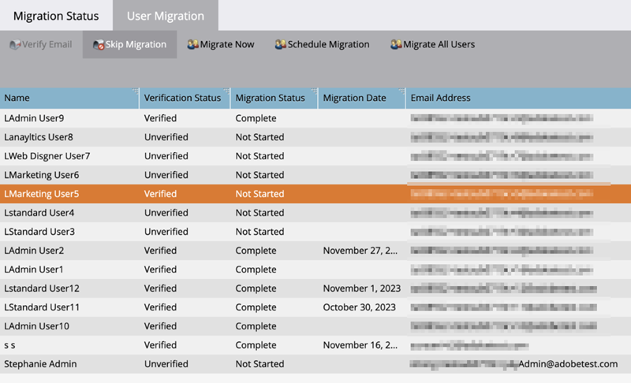
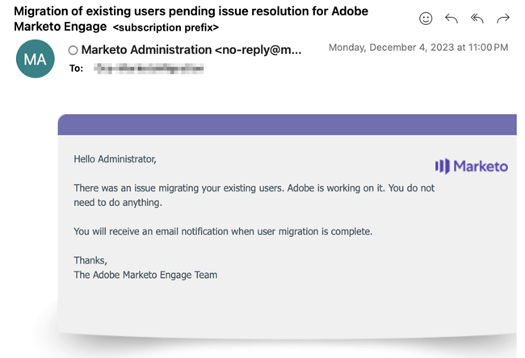

# Migrare a Identity Service {#migrating-to-adobe-identity}

Quando Adobe pianifica la migrazione di un utente di un abbonamento, gli amministratori dei prodotti Marketo Engage avranno accesso alla console di migrazione, a cui è possibile accedere dal menu di navigazione nell’area Amministratore in Integrazione.

## Pre-migrazione {#pre-migration}

Prima dell’inizio della migrazione, un amministratore può modificare la data di inizio della migrazione degli utenti per il proprio abbonamento passando alla schermata Pre-migrazione nella console di migrazione. Per modificare la data, l&#39;amministratore può fare clic sul pulsante **Modifica**.

L’amministratore può scegliere una data compresa tra 8 e 30 giorni nel futuro. Quando viene selezionata una data, l&#39;amministratore deve fare clic su **Salva** per apportare la modifica.

>[!NOTE]
>
>Per richiedere una data prima degli 8 giorni o oltre i 30, o se devi modificare la data dopo il blocco della console di pre-migrazione, invia un&#39;e-mail a `marketocares@marketo.com`.

## Migrazioni ad Adobe Identity {#migrations-to-adobe-identity}

Tutti gli abbonamenti Marketo con fuso orario negli Stati Uniti verranno migrati a partire dalla mezzanotte (ora standard del Pacifico) della data di inizio della migrazione degli utenti. La migrazione degli utenti per tutti gli altri abbonamenti inizierà alla mezzanotte del fuso orario specificato per l’abbonamento. Quando inizia la migrazione degli utenti di un abbonamento, la gestione degli utenti non sarà più disponibile nell’area di amministrazione di Marketo e sarà ottenuta solo in Adobe Admin Console. La gestione dei ruoli rimane nella scheda Utenti e ruoli dell’area di amministrazione di Marketo, nonché nella gestione locale degli utenti (solo API).

Adobe eseguirà automaticamente la migrazione di tutti gli amministratori di Marketo (con un ruolo amministratore standard) tramite e-mail verificate. Quando gli amministratori di Marketo vengono migrati ad Adobe Identity, vengono aggiunti all’abbonamento Adobe Admin Console come amministratore di prodotto per l’abbonamento a Marketo e ricevono il ruolo di amministratore di prodotto Adobe all’interno dell’applicazione Marketo (insieme a tutti gli altri ruoli che avevano in precedenza) e dispongono del diritto Adobe ID all’abbonamento. Gli amministratori riceveranno due e-mail. Una indica che viene assegnato come amministratore di prodotto Admin Console e l’altra che il relativo Adobe ID ha diritto al prodotto Marketo.

>[!IMPORTANT]
>
>Per accedere a Marketo Engage con il tuo Adobe ID, devi fare clic sul pulsante **Accetta invito** nell&#39;e-mail per l&#39;adesione.

**E-mail amministratore prodotto Marketo**

**E-mail adesione Marketo**

**Se la sottoscrizione a Marketo non dispone di SSO in Marketo e/o nell&#39;organizzazione Adobe**, Adobe eseguirà automaticamente la migrazione degli altri utenti. Questo flusso di lavoro mira a fornire il massimo livello di automazione e non è necessaria alcuna azione per eseguire la migrazione. Al termine della migrazione, Marketo Migration Console non verrà più visualizzato nell’area di navigazione di Marketo Admin e tutti gli utenti accederanno a Marketo utilizzando un Adobe ID.

**Se il tuo abbonamento a Marketo dispone di SSO in Marketo e/o nell&#39;organizzazione Adobe**, gli amministratori di Marketo avranno accesso allo strumento Self-Service User Migration della console di migrazione all&#39;inizio della migrazione degli utenti e riceveranno un avviso tramite banner al momento dell&#39;accesso alla pagina My Marketo. L&#39;amministratore sarà responsabile del completamento della migrazione degli utenti mediante lo strumento di migrazione self-service degli utenti.

## Migrazione degli utenti self-service di Marketo {#marketo-self-service-user-migration}

Lo strumento Marketo Self-Service User Migration Console è costituito da due schede.

* **Scheda Stato migrazione**
* **Scheda Migrazione utenti**

Per completare la migrazione self-service sono necessari tre passaggi principali.

1. Esegui la migrazione di tutti gli utenti idonei verificati per l’indirizzo e-mail (scheda Migrazione utenti)
1. Ignora tutti gli utenti non idonei ed eventuali utenti idonei indesiderati (scheda Migrazione utenti)
1. Al termine dei passaggi 1 e 2, completa la conferma della migrazione (scheda Stato migrazione).

### Scheda Stato di migrazione {#migration-status-tab}

La scheda Stato di migrazione fornisce metriche generali sull’avanzamento dei prerequisiti di verifica e-mail degli utenti, sulla migrazione e l’attivazione degli utenti e sul completamento della migrazione dell’abbonamento.

Nella parte superiore dello Stato di migrazione vengono visualizzati la scadenza della migrazione dell’abbonamento e il pulsante per estendere la scadenza. Ulteriori informazioni sulla scadenza della migrazione sono disponibili nella [sezione Scadenza migrazione utenti](#user-migration-expiration).

Nella sezione successiva della scheda Stato di migrazione sono disponibili due barre di avanzamento. La prima barra di avanzamento mostra l’avanzamento del completamento della verifica e-mail dell’utente. La seconda barra di avanzamento mostra la progressione del completamento della migrazione degli utenti.

Successivamente, l’amministratore visualizzerà tre sezioni dello Stato.

* **Verifica e-mail utente**: verifica dello stato degli utenti all&#39;interno della sottoscrizione.
* **Migrazione utenti e attivazione**: migrazione utenti e attivazione (migrazione e adesione al prodotto Marketo Engage) dello stato degli utenti all&#39;interno della sottoscrizione.
* **Conferma migrazione**: stato di completamento della migrazione della sottoscrizione.

#### Verifica e-mail utente {#user-email-verification}

Nella sezione Verifica e-mail utente, un amministratore può trovare lo stato corrente della verifica e-mail per gli utenti nell’abbonamento, prima della migrazione ad Adobe Identity.

Un amministratore può visualizzare lo stato di verifica e-mail dell’abbonamento, la percentuale di utenti nell’abbonamento che hanno completato la verifica e-mail e il numero di utenti contrassegnati come ignorati. Lo stato viene segnalato in base allo stato della verifica e-mail di tutti gli utenti nell’abbonamento. L’amministratore può fare clic sul numero di utenti ignorati e passare alla scheda Migrazione utenti per visualizzarli.

L’e-mail di verifica può essere inviata nuovamente da un amministratore nelle schede Migrazione utenti della console di migrazione e Utente e ruoli dell’area Amministratore di Marketo, oppure dall’utente nelle Impostazioni account. Come le e-mail di invito dell’utente, il collegamento nell’e-mail di verifica scade tra 3 giorni. Ulteriori informazioni sulla verifica tramite posta elettronica sono disponibili nella [Community](https://nation.marketo.com/) e nella [documentazione sulla verifica tramite posta elettronica](/help/marketo/product-docs/administration/users-and-roles/email-verification.md).

>[!IMPORTANT]
>
>Se un utente di Marketo Engage non verifica il proprio indirizzo e-mail, non può effettuare la migrazione a un Adobe ID e perderà l’accesso all’abbonamento a Marketo al termine della migrazione. Per recuperare l’accesso, un amministratore di prodotto Marketo deve aggiungerli come nuovo utente.

#### Migrazione e attivazione degli utenti {#user-migration-and-activation}

Nella sezione Migrazione e attivazione utenti, un amministratore può trovare lo stato corrente della migrazione utente totale e l’adesione al sistema Adobe Identity Management.

Un amministratore può visualizzare la percentuale di utenti nella sottoscrizione che sono stati trasferiti a un Adobe ID o contrassegnati come Ignorati. Lo stato viene segnalato sullo stato della migrazione di tutti gli utenti a un Adobe ID nell’abbonamento, oppure viene contrassegnato come Ignorato e non verrà migrato. Quando gli utenti vengono trasferiti e hanno diritto a Marketo Engage, oppure vengono saltati, questo stato viene aggiornato.

#### Conferma della migrazione {#migration-confirmation}

Nella sezione Conferma della migrazione, verrà richiesto a un amministratore di confermare il completamento della migrazione utente per l’abbonamento.

Una volta conteggiati tutti gli utenti della sottoscrizione (trasferiti o ignorati), verrà visualizzato il pulsante &quot;Completa migrazione&quot;.

L&#39;amministratore che esegue la migrazione dovrà completare la conferma della migrazione facendo clic sul pulsante **Completa migrazione**. Verrà richiesto di **Confermare**.

Una volta confermato il completamento della migrazione utente, la console di migrazione verrà rimossa dal menu di navigazione Admin.

### Scadenza migrazione utenti {#user-migration-expiration}

Adobe richiede ai clienti di completare le migrazioni self-service entro 30 giorni. La migrazione degli utenti o il completamento della migrazione non verrà impedito agli amministratori se la data di scadenza è stata superata. Tuttavia, potranno eseguire la migrazione degli utenti solo su richiesta. Se un amministratore ha bisogno di più tempo, può estendere la data di scadenza dell’abbonamento.

Facendo clic sul pulsante **Estendi scadenza**, la data verrà aggiornata a una settimana dopo. Un amministratore può estendere la scadenza fino a tre volte.

Se non completi la migrazione entro la data di scadenza, Adobe contatterà.

### Scheda Migrazione utenti {#user-migration-tab}

La scheda Migrazione utenti fornisce agli amministratori gli strumenti necessari per avere il controllo completo della migrazione degli utenti.

Gli amministratori possono:

* Attiva le e-mail di verifica per gli utenti non verificati tramite il pulsante &quot;Verifica e-mail&quot;
* Salta la migrazione degli utenti se gli utenti sanno che l’amministratore può/non verificherà la loro e-mail o non deve essere migrata tramite il pulsante &quot;Salta migrazione&quot;
* Eseguire la migrazione degli utenti selezionati su richiesta tramite il pulsante &quot;Esegui migrazione ora&quot;
* Pianifica la migrazione degli utenti per gli utenti selezionati per una data specifica tramite il pulsante &quot;Pianifica migrazione&quot;
* Esegui la migrazione di tutti gli utenti idonei su richiesta (non è necessaria alcuna selezione di utenti) tramite il pulsante &quot;Migra tutti gli utenti&quot;

**Verifica e-mail**

La verifica e-mail è necessaria per la migrazione di un utente a un Adobe ID. Se alcuni utenti non hanno verificato il proprio indirizzo e-mail e devono essere trasferiti, l’amministratore può attivare l’invio dell’e-mail di verifica all’utente. Selezionando un utente non verificato, sarà possibile fare clic sul pulsante &quot;Verifica e-mail&quot;.

Quando l&#39;amministratore fa clic sul pulsante **Verifica e-mail**, riceverà una notifica dell&#39;invio dell&#39;e-mail.

**Ignora e annulla migrazione utenti**

Durante la migrazione degli utenti, è necessario eseguire o saltare la migrazione di tutti gli utenti. Adobe richiede agli amministratori di confermare che non verrà eseguita la migrazione di un utente e che un amministratore contrassegni l’utente come ignorato. In caso contrario, l’amministratore non sarà in grado di confermare il completamento della migrazione utente. Al termine della migrazione, tutti gli utenti ignorati perderanno l’accesso a Marketo.

>[!IMPORTANT]
>
>Un amministratore deve ignorare tutti gli utenti con e-mail non verificate. Se alcuni utenti hanno verificato le e-mail, ma l’amministratore non desidera eseguirne la migrazione per alcun motivo, deve contrassegnarle come ignorate.

Per saltare un utente, l’amministratore può selezionare gli utenti desiderati. Il pulsante &quot;Ignora migrazione&quot; diventa selezionabile. Facendo clic sul pulsante **Ignora migrazione**, la pagina verrà aggiornata e lo stato di verifica e migrazione dell&#39;utente selezionato verrà aggiornato a &#39;Ignorato&#39;.

Un amministratore può annullare il salto di un utente precedentemente ignorato, se è determinato che l’utente deve essere migrato.

Per non saltare un utente, l’amministratore può selezionare l’utente desiderato. Il pulsante &#39;Unskip Migration&#39; (Annulla migrazione) diventerà cliccabile. Facendo clic sul pulsante **Annulla migrazione**, la pagina verrà aggiornata.  Lo stato di verifica dell&#39;utente selezionato verrà aggiornato al suo stato corrente, ovvero &#39;Verificato&#39; o &#39;Non verificato&#39;, e lo stato di migrazione dell&#39;utente verrà aggiornato a &#39;Non avviato&#39;.

>[!NOTE]
>
>Il pulsante &#39;Annulla migrazione&#39; sarà attivo solo se tutti gli utenti selezionati hanno uno stato di migrazione &#39;Ignorato&#39;.

### Migrazione degli utenti Marketo agli Adobe ID {#migrating-marketo-users-to-adobe-ids}

Gli amministratori di prodotto Marketo potranno selezionare gli utenti da migrare in batch o tutti gli utenti idonei contemporaneamente. Una volta selezionati gli utenti, gli amministratori possono scegliere &quot;Migra ora&quot; o &quot;Pianifica migrazione&quot; per una data successiva, offrendo agli amministratori flessibilità e controllo su quali utenti vengono migrati e quando. Agli amministratori viene inoltre offerta l’opzione &quot;Migra tutti gli utenti&quot; in un abbonamento.

Ad esempio, un amministratore può selezionare un gruppo di &quot;utenti avanzati&quot; di cui si desidera eseguire prima la migrazione. Una volta completate correttamente le migrazioni degli utenti, è possibile selezionare diversi gruppi di utenti in base a variabili quali workspace/business o funzione/ruolo per eseguire ulteriori migrazioni batch degli utenti. In alternativa, può decidere di eseguire la migrazione degli altri utenti degli abbonamenti dopo il completamento del primo batch. L’obiettivo è fornire agli utenti la massima flessibilità nella distribuzione degli Adobe ID.

Tutte le migrazioni degli utenti avvengono contemporaneamente e dovrebbero essere completate correttamente entro sessanta secondi. Durante la migrazione di un utente specifico, l’utente potrebbe perdere l’accesso per un massimo di 1 minuto e ciò solo se ha effettuato l’accesso all’applicazione. Al termine della migrazione utente, l’utente riceverà un’e-mail su come accedere a Marketo Engage con un’identità Adobe. L&#39;utente deve accettare l&#39;invito tramite il collegamento del pulsante nell&#39;e-mail _prima_ di poter accedere con un Adobe ID. Le istruzioni su come accedere a Marketo Engage con un Adobe ID [&#x200B; sono disponibili qui](/help/marketo/product-docs/administration/marketo-with-adobe-identity/user-sign-in-with-adobe-id.md).

Le migrazioni degli utenti vengono elaborate in modo indipendente; pertanto, se una migrazione non riesce, Adobe continuerà a elaborare le migrazioni degli altri utenti. Se si verifica un errore di migrazione utente, non è richiesta alcuna azione da parte di un amministratore. L’amministratore riceverà una notifica e-mail relativa all’errore e verrà avvisato che Adobe sta lavorando per risolvere il problema immediatamente. Se la migrazione di un utente non riesce e l’utente è connesso a Marketo Engage, potrebbe perdere l’accesso per un massimo di due minuti durante i nuovi tentativi di migrazione. Se la migrazione di un utente non riesce, l’utente può continuare ad accedere a Marketo Engage con la propria identità Marketo fino a quando non riceve una notifica e-mail di avvenuta migrazione e viene invitato ad accedere con un Adobe ID.

**Esegui migrazione ora**

Un amministratore può selezionare uno o più utenti per la migrazione su richiesta. Questo attiverà immediatamente la migrazione degli utenti. Per eseguire la migrazione di uno o più utenti, l&#39;amministratore può selezionare gli utenti desiderati e fare clic sul pulsante Migra ora.

>[!NOTE]
>
>Il pulsante &quot;Esegui migrazione ora&quot; sarà attivo solo se tutti gli utenti selezionati dispongono di uno stato di verifica &quot;Verificato&quot;.

Facendo clic sul pulsante **Esegui migrazione ora**, all&#39;amministratore verrà richiesto di confermare la migrazione degli utenti selezionati. Una volta confermata dall’amministratore, le migrazioni degli utenti inizieranno l’elaborazione il prima possibile.

**Pianifica migrazione**

Un amministratore può selezionare uno o più utenti per pianificare la migrazione in una data successiva. Per pianificare la migrazione per uno o più utenti, l’amministratore seleziona gli utenti desiderati e sarà possibile fare clic sul pulsante &quot;Pianifica migrazione&quot;.

>[!NOTE]
>
>Il pulsante &quot;Migrazione pianificata&quot; sarà attivo solo se per tutti gli utenti è impostata la verifica dello stato &quot;Verificato&quot; e la migrazione dello stato &quot;Non avviato&quot; o &quot;Adobe ID creato&quot;.

Facendo clic sul pulsante **Pianifica migrazione**, all&#39;amministratore verrà richiesto di selezionare la data di migrazione desiderata per gli utenti selezionati. L’amministratore può selezionare solo date precedenti alla data di scadenza della migrazione della sottoscrizione. Quando l’amministratore conferma, l’elaborazione delle migrazioni utente verrà pianificata per la data selezionata.

>[!NOTE]
>
>Tutti gli abbonamenti Marketo con fuso orario negli Stati Uniti verranno migrati a partire dalla mezzanotte (ora standard del Pacifico) della data di inizio della migrazione. La migrazione degli utenti per tutti gli altri abbonamenti inizierà alla mezzanotte del fuso orario specificato per l’abbonamento.

**Migra tutti gli utenti**

Un amministratore può scegliere di eseguire la migrazione di tutti gli utenti idonei in un abbonamento in qualsiasi momento. Questo attiverà immediatamente la migrazione degli utenti idonei. Gli utenti idonei sono gli utenti con e-mail verificate che non sono ancora stati trasferiti.

Facendo clic sul pulsante **Migra tutti gli utenti**, all&#39;amministratore verrà richiesto di **Conferma** la migrazione di tutti gli utenti idonei. Quando l’amministratore conferma, le migrazioni degli utenti inizieranno l’elaborazione il prima possibile.

