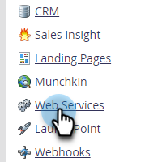

# Informazioni API per l’esportazione in blocco {#bulk-export-api-information}

Scopri come controllare la capacità di Estrazione di massa occupata dall’istanza di Marketo Engage negli ultimi sette giorni.

>[!NOTE]
>
>Se hai bisogno di una capacità aggiuntiva, contatta il rappresentante commerciale di riferimento.

1. Vai a **Amministratore** area.

   

1. Fai clic su **Servizi Web**.

   

1. Scorri verso il basso fino alla scheda Informazioni API di esportazione in blocco . Fai clic sul numero accanto a &quot;Ultimi 7 giorni&quot; per visualizzare l’utilizzo al giorno/utente API.

   

   

>[!NOTE]
>
>L&#39;allocazione per l&#39;istanza di Marketo Engage viene ripristinata ogni giorno alle 12:00 CST.
