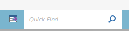

# Ispezionare campagna {#campaign-inspector}

Utilizza Campaign Inspector per visualizzare ed eseguire ricerche in tutte le campagne avanzate in un’unica posizione.

## Abilita Ispettore campagna {#enable-campaign-inspector}

1. Passa alla schermata **[!UICONTROL Admin]**.

   

1. Fai clic su **[!UICONTROL Treasure Chest]**.

   

1. Fare clic su **[!UICONTROL Edit]** accanto a Ispettore campagna.

   

1. Selezionare la casella di controllo **[!UICONTROL Enabled]** e fare clic su **[!UICONTROL Save]**.

   

   >[!NOTE]
   >
   >L’area di lavoro desiderata deve essere selezionata nella struttura per visualizzare la scheda Ispettore campagna dopo l’abilitazione.

## Utilizzo di Campaign Inspector {#using-campaign-inspector}

Una volta abilitata, la scheda Ispettore campagna si trova accanto alla scheda Attività di marketing.

Fare clic sul menu a discesa **[!UICONTROL Active Campaigns]** per filtrare in base a diversi tipi di campagne.

Nella parte inferiore della pagina, puoi accedere a strumenti utili come la barra di ricerca o esportare i risultati.

