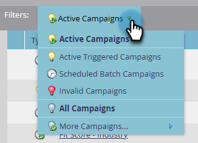

# Ispettore campagna {#campaign-inspector}

Utilizza Campaign Inspector per visualizzare/cercare tutte le campagne avanzate in un’unica posizione.

## Abilita Ispettore campagna {#enable-campaign-inspector}

1. Vai a **[!UICONTROL Amministratore]** area.

   

1. Clic **[!UICONTROL Treasure Chest]**.

   

1. Clic **[!UICONTROL Modifica]** accanto a Ispettore campagna.

   

1. Seleziona la **[!UICONTROL Abilitato]** e fai clic su **[!UICONTROL Salva]**.

   

   >[!NOTE]
   >
   >L’area di lavoro desiderata deve essere selezionata nella struttura per visualizzare la scheda Ispettore campagna dopo che è stata abilitata.

## Utilizzo di Campaign Inspector {#using-campaign-inspector}

Una volta abilitata, la scheda Ispettore campagna si trova accanto alla scheda Attività di marketing.

Fai clic su **[!UICONTROL Campagne attive]** per filtrare in base a diversi tipi di campagne.

Nella parte inferiore della pagina, puoi accedere a strumenti utili come la barra di ricerca o esportare i risultati.

