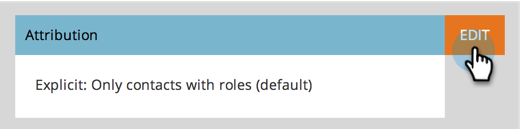

# Modificare le impostazioni di attribuzione per Analytics {#change-attribution-settings-for-analytics}

Puoi modificare il modo in cui Marketo collega i contatti alle opportunità di attribuzione di primo e più contatti, alle metriche di conversione dei lead e al flag di opportunità influenzato dal marketing.

Queste impostazioni avranno un impatto [!UICONTROL Gestione ricavi] rapporti in [Analisi opportunità programma](/help/marketo/product-docs/reporting/revenue-cycle-analytics/program-analytics/understanding-the-program-opportunity-analysis-area.md), [Analisi dell’opportunità](/help/marketo/product-docs/reporting/revenue-cycle-analytics/revenue-explorer/understanding-opportunity-analysis-in-revenue-explorer.md), e Analisi dei lead. Questo inciderà anche sulla [!UICONTROL Analizzatore di programmi] rapporto.

1. Vai a **[!UICONTROL Amministratore]** area.

   

1. Clic **[!UICONTROL Analisi del ciclo dei ricavi]**.

   

1. Fai clic su **[!UICONTROL Modifica]** collega in **[!UICONTROL Attribuzione]**.

   

   >[!TIP]
   >
   >La modifica di questa impostazione non comporta la modifica di alcun dato di Marketo, ma semplicemente modifica il modo in cui vengono eseguiti i rapporti. Questa funzione può essere ripristinata in qualsiasi momento.

1. Seleziona un’opzione e fai clic su **[!UICONTROL Salva]**.

   

   >[!NOTE]
   >
   >**Definizione**
   >
   >**[!UICONTROL Esplicito]**: solo contatti con ruoli (impostazione predefinita).
   >
   >**[!UICONTROL Ibrido]**: contatti con i ruoli, se disponibili. Se non ne è disponibile alcuno, vengono utilizzati tutti i contatti negli account.
   >
   >**[!UICONTROL Implicito]**: tutti i contatti indipendentemente dal ruolo.

>[!CAUTION]
>
>Quando si utilizza **[!UICONTROL Implicito]**, Marketo esaminerà sempre tutti i contatti associati all’account, indipendentemente dal ruolo. **Marketo consiglia vivamente di [!UICONTROL Esplicito] modalità**. Utilizzo di [!UICONTROL Implicito] può creare falsi positivi, ovvero persone che hanno il merito di un’opportunità pur non avendo una reale influenza su di essa. Utilizzare [!UICONTROL Implicito] con cautela.
