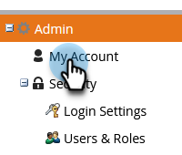

# Cambia il tuo fuso orario {#change-time-zone}

Scopri come modificare il fuso orario nell’abbonamento a Marketo Engage.

1. Passa alla schermata **[!UICONTROL Admin]**.

   

1. Seleziona **[!UICONTROL My Account]**.

   

1. Fai clic sulla scheda **[!UICONTROL Edit Location Settings]**.

   

1. Viene visualizzata una finestra modale. Fare clic sul menu a discesa **[!UICONTROL Time zone]** e selezionare.

   

   >[!NOTE]
   >
   >_Lingua_ e _impostazioni locali_ sono disattivate, in quanto è necessario accedere a tali impostazioni nel [profilo account Adobe](https://account.adobe.com/profile){target="_blank"}.

1. Fai clic su **[!UICONTROL Save]**.
