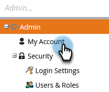

# Modifica la password di Marketo {#change-your-marketo-password}

Cambia la password di Marketo con questi semplici passaggi.

1. Vai a **[!UICONTROL Amministratore]** area.

   

1. Clic **[!UICONTROL Il mio account]**.

   

1. Clic **[!UICONTROL Cambia password]**.

   

1. Inserisci la Vecchia password e la Nuova password, quindi fai clic su **[!UICONTROL Salva]**.

   

   >[!NOTE]
   >
   >Tieni presente i requisiti della password quando effettui l’aggiornamento.
