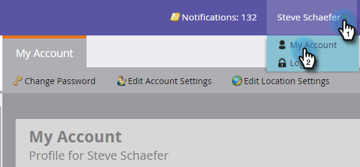

# Modifica la password Marketo {#change-your-marketo-password}

Modifica la tua password Marketo con questi semplici passaggi.

1. Qualsiasi utente Marketo può fare clic sul proprio nome e **Il mio account**.

   

1. Gli amministratori possono inoltre fare clic su **Amministratore** e quindi su **Cambia password** per modificare la password amministratore.

   

1. Immetti la vecchia password e la nuova password, quindi fai clic su **Salva** quando la nuova password soddisfa tutti i requisiti.

   

   Tenetela segreta! La tenga al sicuro!

   >[!TIP]
   >
   >Qual è una buona password? Qualcosa a lungo con un sacco di lettere, numeri e simboli come &quot;M@rk3to!$ Gre@t&quot;. Eccetto, non quello. Siate creativi e createvi.
