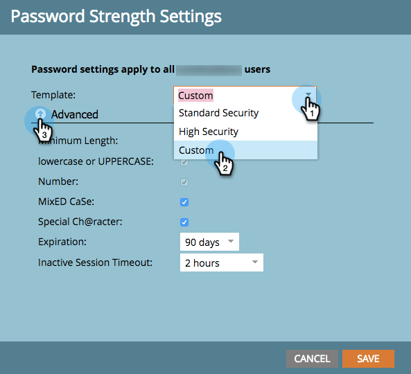

# Modifica le impostazioni di protezione password {#change-your-password-security-settings}

Controlla i criteri della password del tuo abbonamento. Ecco come.

>[!NOTE]
>
>**Autorizzazioni amministratore richieste**

1. In **Amministratore**, fai clic su **Impostazioni di accesso**.

   

1. In **Impostazioni protezione**, fai clic su **Modifica**.

   

1. Seleziona un **Modello**. Per opzioni avanzate, fai clic sul menu a discesa **Avanzate** .

   >[!NOTE]
   >
   >Un modello è solo una configurazione predefinita. Lo standard è buono. L&#39;alta sicurezza è la più forte. Personalizza ti consente di creare il tuo.

   

   >[!TIP]
   >
   >In **Personalizzato**, seleziona le caselle per indicare quali caratteristiche desideri che gli utenti includano quando creano le password.

1. Imposta la **Scadenza**. Questa funzione richiede automaticamente agli utenti di reimpostare le password dopo un certo periodo di tempo. Questo include anche l’utente amministratore .

   >[!CAUTION]
   >
   >Gli utenti esistenti non riceveranno alcuna notifica delle modifiche. Imposta **Scadenza** a 30 giorni prima per garantire che tutti siano aggiornati alle nuove impostazioni, quindi ripristina la cadenza originale.

   

1. Imposta il **Timeout sessione inattiva**. Questo determina per quanto tempo un utente può essere inattivo prima di dover effettuare nuovamente l&#39;accesso a Marketo.

   

   La sicurezza è un affare serio. Ti abbiamo preso la schiena.
