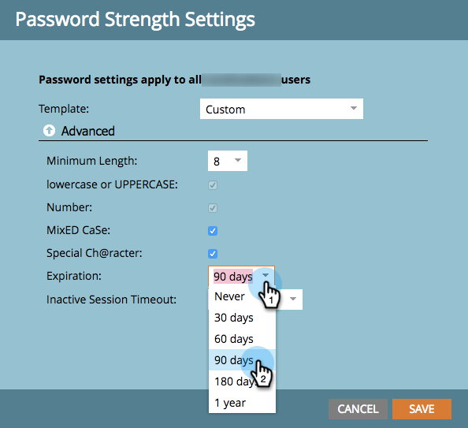

# Modifica le impostazioni di protezione tramite password {#change-your-password-security-settings}

Controlla i criteri password della tua iscrizione. Ecco come.

>[!NOTE]
>
>**Autorizzazioni amministratore richieste**

1. Vai a **[!UICONTROL Amministratore]** area.

   

1. Clic **[!UICONTROL Impostazioni di accesso]**.

   

1. Sotto **[!UICONTROL Impostazioni di protezione]**, fai clic su **[!UICONTROL Modifica]**.

   

1. Seleziona un **[!UICONTROL Modello]**. Per opzioni avanzate, fai clic su **[!UICONTROL Avanzate]** a discesa.

   

   >[!NOTE]
   >
   >Un modello è solo una configurazione predefinita. Lo standard è buono. L&#39;alta sicurezza è la più forte. Personalizzato consente di creare il proprio.

   >[!TIP]
   >
   >In entrata **[!UICONTROL Personalizzato]**, selezionare le caselle per indicare le caratteristiche che si desidera includere quando si creano le password.

1. Imposta il **[!UICONTROL Scade]**. Questa funzione richiede automaticamente agli utenti di reimpostare le password dopo un certo periodo di tempo. Questo include anche l’utente amministratore.

   

   >[!CAUTION]
   >
   >Gli utenti esistenti non verranno informati delle modifiche. Imposta **[!UICONTROL Scade]** , impostare dapprima su 30 giorni per assicurarsi che tutti abbiano eseguito l&#39;aggiornamento alle nuove impostazioni, quindi riportarlo alla cadenza originale.

1. Imposta il **[!UICONTROL Timeout sessione inattiva]**. Questo determina per quanto tempo un utente può rimanere inattivo prima di dover accedere nuovamente a Marketo.

   
