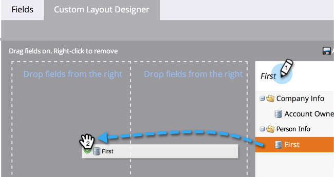

# Creazione di una scheda personalizzata per la pagina Dettagli persona {#creating-a-custom-tab-for-the-person-detail-page}

Se cerchi più volte un insieme specifico di campi nei dettagli delle persone, puoi creare un layout personalizzato per semplificare le cose.

1. Vai a **Amministratore** area.

   

1. Fai clic su **Gestione dei campi**.

   

1. Fai clic sul pulsante **Progettazione layout personalizzato** scheda .

   

1. Trova un campo da aggiungere, quindi trascinalo nell’area di lavoro.

   

1. Continua ad aggiungere campi fino a ottenere il layout desiderato nel modo desiderato.

   

   >[!NOTE]
   >
   >Sono disponibili due colonne con cui lavorare.

   Se si decide di rimuovere un campo, fare clic con il pulsante destro del mouse sul campo che si desidera rimuovere e fare clic su **Elimina**.

   

   Lavoro fantastico! Quando carichi i dettagli di una persona, puoi utilizzare il layout personalizzato per accedere alle informazioni più importanti.

   
