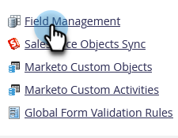
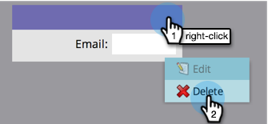

# Creare una scheda personalizzata per la pagina Dettagli persona {#creating-a-custom-tab-for-the-person-detail-page}

Se devi accedere spesso a un set specifico di campi nella pagina dei dettagli della persona, puoi creare un layout personalizzato.

1. Passa alla schermata **[!UICONTROL Admin]**.

   

1. Fai clic su **[!UICONTROL Field Management]**.

   

1. Fai clic sulla scheda **[!UICONTROL Custom Layout Designer]**.

   

1. Trova un campo da aggiungere, quindi trascinalo e rilascialo nell’area di lavoro.

   

1. Continuare ad aggiungere i campi fino a disporre del layout nel modo desiderato.

   

   >[!NOTE]
   >
   >Hai due colonne con cui lavorare.

   Se si decide di rimuovere un campo, fare clic con il pulsante destro del mouse sul campo che si desidera rimuovere e scegliere **[!UICONTROL Delete]**.

   

   Quando carichi i dettagli di una persona, puoi utilizzare il layout personalizzato per accedere alle informazioni che ti interessano.

   
