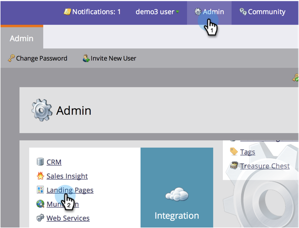

# Personalizzare gli URL della pagina di destinazione con un CNAME (amministrazione) {#customize-your-landing-page-urls-with-a-cname-administration}

Anche se Marketo ospita le pagine di destinazione, l’URL deve essere personalizzato per la tua azienda.

>[!NOTE]
>
>Nessun CNAME:
>
>https://na-sj02.marketo.com/lp/mktodemoaccount126/UnsubscribePage.html
>
>CNAME con marchio:
>
>https://go.**Società** com/UnsuscribePage.html

>[!NOTE]
>
>**Autorizzazioni amministratore richieste**

Prepariamoci!

1. Scegli un CNAME.

   È la parte anteriore dell&#39;URL. Esempi:

   * **andare**.YourCompany.com/NameOfPage.html
   * **info**.YourCompany.com/NameOfPage.html
   * **pagine**.YourCompany.com/NameOfPage.html

   La parola (più YourCompany.com) è denominata CNAME. Ne avrete bisogno in un secondo momento, quindi prendete nota.

1. Trova la stringa account.

1. Vai a **Amministratore** e fai clic su **Pagine di destinazione**.

   

1. Sotto la **Pagine di destinazione** , copia la stringa account dalla sezione Impostazioni.

   

1. Avrete anche bisogno di questo più tardi, quindi prendete nota di esso.

1. Invia richiesta all&#39;IT.

1. Chiedi al tuo personale IT di configurare il seguente CNAME (sostituisci la parola [CNAME] e [STRINGA ACCOUNT] con il testo del passaggio precedente):

   [CNAME].YourCompany.com > [STRINGA ACCOUNT].mktoweb.com

1. Completa l’impostazione del CNAME.

1. Una volta creato il CNAME, vai a **Amministratore** e fai clic su **Pagine di destinazione**.

   

1. Sotto la **Impostazioni** sezione, fai clic su **Modifica**.

   

1. Immetti il tuo CNAME in **Nome di dominio per le pagine di destinazione**, inserisci il **Pagina di fallback**, inserisci il **Homepage** e fai clic su **Salva**.

   

La pagina di fallback è il percorso in cui le persone verranno reindirizzate se la pagina di destinazione di Marketo non è disponibile.

Bel lavoro! Le pagine di destinazione sono ora contrassegnate con il marchio del dominio aziendale.
