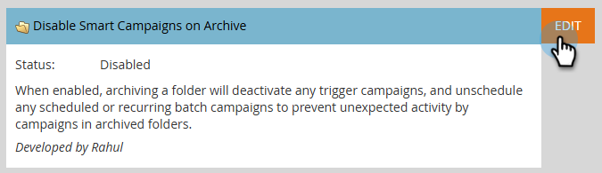

# Disabilita campagne intelligenti nell’archivio {#disable-smart-campaigns-on-archive}

Quando questa funzione è abilitata, l’archiviazione di una cartella o di un programma ne disattiva automaticamente le campagne per evitare attività impreviste.

Quando si archivia una cartella o un programma oppure si sposta una campagna Smart attiva in una cartella già archiviata, Marketo Engage interrompe l’esecuzione delle campagne interessate:

* **Le campagne attivate** sono disattivate.
* **Le esecuzioni in sospeso delle campagne batch** sono state annullate.
* **Le campagne eseguibili** non dispongono di uno stato di esecuzione, pertanto non viene eseguita alcuna azione.

## Come abilitare {#how-to-enable}

1. Nella sezione **Admin**, fai clic su **Treasure Chest**.

   

1. Scorri fino a _Disabilita campagne avanzate nell&#39;archivio_ e fai clic su **Modifica**.

   

1. Selezionare la casella di controllo **Abilitato** e fare clic su **Salva**.

   

<table>
  <tr>
    <td><b>Abilitato (selezionato)</b></td>
    <td>L’archiviazione disattiva ogni campagna in base alle regole di cui sopra.</td>
  </tr>
  <tr>
    <td><b>Disabilitato (non selezionato)</b></td>
    <td>L’archiviazione di una cartella o di un programma continua a funzionare, ma le campagne vengono lasciate in esecuzione o pianificate così come sono.</td>
  </tr>
</table>

>[!IMPORTANT]
>
>Dopo aver attivato questa impostazione, è necessario aggiornare il browser per rendere effettiva la modifica.

## Azioni supportate

Le azioni seguenti disattivano le campagne quando _Disabilita campagne intelligenti nell&#39;archivio_ è abilitato:

* Trascinamento di una **cartella** contenente campagne attive in una cartella archiviata
* Trascinamento di un **programma** (di qualsiasi tipo) contenente campagne attive in una cartella archiviata
* Trascinamento di una **singola campagna avanzata** in una cartella archiviata
* Fare clic con il pulsante destro del mouse su **Sposta** in una singola Smart Campaign in una cartella archiviata
* Fare clic con il pulsante destro del mouse su **Sposta cartella** in una cartella contenente campagne attive in una cartella archiviata
* Fare clic con il pulsante destro del mouse su **Sposta** in un programma contenente campagne attive in una cartella archiviata
* Fare clic con il pulsante destro del mouse su **Converti in cartella archiviata** in una cartella per archiviarla senza spostarla

>[!NOTE]
>
>Se all’interno della cartella o del programma in fase di archiviazione viene fatto riferimento a una campagna avanzata (ad esempio, tramite un passaggio di flusso &quot;Richiedi campagna&quot;), l’archiviazione viene bloccata per evitare di interrompere l’altra campagna.
