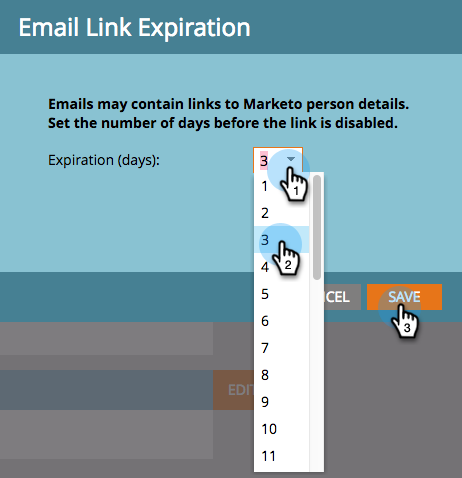

# Modifica scadenza collegamento in rapporti e avvisi {#edit-link-expiration-in-reports-and-alerts}

I collegamenti nelle e-mail di abbonamento ai rapporti scadono dopo tre giorni. Per modificare il tempo di scadenza di questi collegamenti, segui questi passaggi.

>[!NOTE]
>
>**Autorizzazioni amministratore richieste**

1. In **Amministratore**, fai clic su **Impostazioni di accesso**.

   

1. Fare clic su **Modifica scadenza URL**.

   

1. Nel menu a discesa , seleziona il numero di giorni prima della scadenza del collegamento. Fare clic su **Salva**.

   

Freddo, hai modificato le impostazioni di scadenza del collegamento e-mail.

>[!NOTE]
>
>Ricorda che questi si applicano solo ai collegamenti nei rapporti e negli avvisi, non alle e-mail di marketing.
