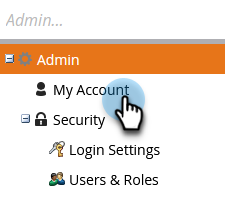

# Modificare le impostazioni abbonamento {#edit-subscription-settings}

Se hai accesso a più abbonamenti Marketo e desideri essere sicuro di quale stai utilizzando, prova a dare a ciascuno un nome univoco. Tale nome viene quindi visualizzato nella parte superiore della pagina di abbonamento.

Ad esempio, se lavori sia nelle istanze di produzione che in quelle di sandbox, puoi denominare una sottoscrizione **Marketo Production** e l&#39;altra **Marketo Sandbox**.

1. Vai a **[!UICONTROL Admin]**.

   

1. Fai clic su **[!UICONTROL My Account]**.

   

1. Fai clic su **[!UICONTROL Edit Subscription Information]**.

   

1. Apportare le modifiche desiderate e fare clic su **[!UICONTROL Save]**.

   
