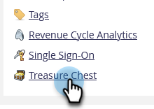

# Attiva o disattiva le caratteristiche del torace del tesoro {#enable-or-disable-treasure-chest-features}

Il Torace del Tesoro contiene divertenti caratteristiche sperimentali che non sono completamente supportate.

>[!NOTE]
>
>**Autorizzazioni amministratore richieste**

1. Vai a **Amministratore** area.

   

1. Fai clic su **Torace del tesoro**.

   

1. Fai clic su **Modifica** per la funzione che si desidera attivare o disattivare.

   

1. Controlla la **Abilitato** per abilitare o deselezionare per disabilitare, quindi fare clic su **Salva**.

   

   >[!TIP]
   >
   >Potrebbe essere necessario disconnettersi e tornare a Marketo per verificare che le modifiche abbiano effetto.
