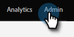
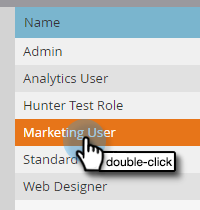
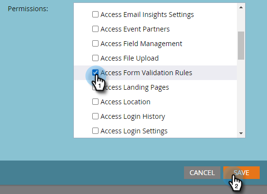
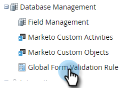
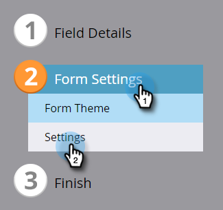
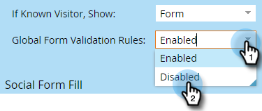

# Regole di convalida del modulo globale {#global-form-validation-rules}

Questa funzione consente di bloccare l&#39;invio a Marketo Engage Form di domini specifici.

## Come abilitare l’accesso {#how-to-enable-access}

Prima di poter utilizzare questa funzione, devi abilitarne l’autorizzazione per il ruolo desiderato.

1. In Marketo, fare clic su **[!UICONTROL Admin]**.

   

1. Fai clic su **[!UICONTROL Users & Roles]**.

   

1. Fai clic sulla scheda **[!UICONTROL Roles]**.

   

1. Fare doppio clic sul ruolo a cui si desidera concedere le autorizzazioni.

   

1. Fai clic sul segno **+** accanto a **Access Admin**.

   

1. Scorri verso il basso e seleziona **[!UICONTROL Access Form Validation Rules]**, quindi fai clic su **[!UICONTROL Save]**.

   

## Crea nuova regola di convalida modulo {#create-new-form-validation-rule}

>[!IMPORTANT]
>
>Queste regole verranno applicate a tutti i moduli delle sottoscrizioni Marketo Engage.

1. In Marketo, fare clic su **[!UICONTROL Admin]**.

   

1. Fai clic su **[!UICONTROL Global Form Validation Rule]**.

   

1. Fai clic su **[!UICONTROL New Form Validation Rule]**.

   

   >[!NOTE]
   >
   >L&#39;elenco a discesa [!UICONTROL Form Validation Rule Actions] consente di eliminare o modificare le regole esistenti.

1. Assegna un nome alla regola, fornisci una descrizione facoltativa e inserisci il messaggio di errore che desideri venga visualizzato dai visitatori del modulo. Immettere uno o più domini da bloccare nella casella delle regole, selezionare **[!UICONTROL Activate Rule]** e fare clic su **[!UICONTROL Create]**.

   

>[!NOTE]
>
>Marketo Engage dispone di un elenco Bloccati definito di domini e-mail consumer gratuiti che vengono bloccati quando si utilizza la regola di Elenco Bloccati del dominio e-mail consumer pre-caricata [Visualizza l&#39;elenco qui](/help/marketo/product-docs/administration/settings/assets/freemaildomains.csv) (per scaricare, assicurati che il browser sia aggiornato e possa accettare i download).

## Disattivazione dell&#39;accesso per modulo{#how-to-disable-access-per-form}

Una volta abilitate, le regole vengono applicate a tutti i moduli. Se tuttavia si dispone di un modulo con requisiti specifici e non si desidera rifiutare nulla, è possibile disabilitare [!UICONTROL Global Form Validation Rules] nelle impostazioni del modulo.

1. Nella forma desiderata, fai clic su **[!UICONTROL Form Settings]**, quindi su **[!UICONTROL Settings]**.

   

1. Fare clic sull&#39;elenco a discesa **[!UICONTROL Global Form Validation Rules]** e scegliere **[!UICONTROL Disabled]**.

   

Quando approvi e pubblichi il modulo, questo ignorerà [!UICONTROL Global Form Validation Rules].
