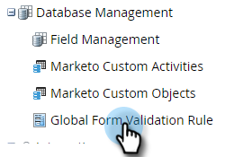
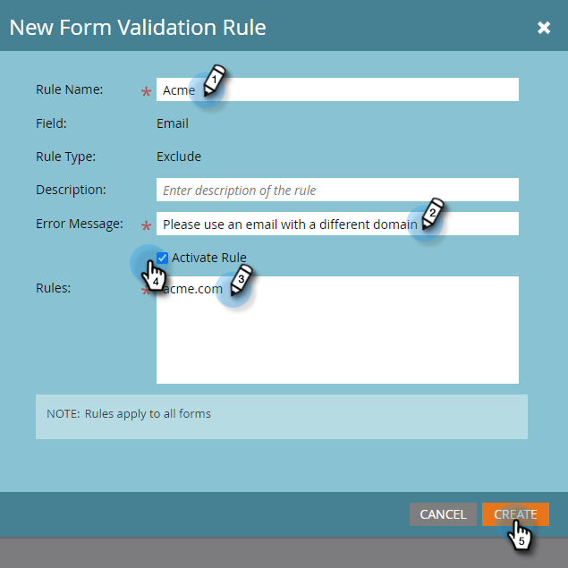

# Regole di convalida globali dei moduli {#global-form-validation-rules}

Questa funzione ti consente di bloccare l’invio di domini specifici ai moduli di Marketo Engage.

## Come abilitare l&#39;accesso {#how-to-enable-access}

Prima di poter utilizzare questa funzione, è necessario abilitarne l’autorizzazione per il ruolo desiderato.

1. In Marketo, fai clic su **Amministratore**.

   

1. Fai clic su **Utenti e ruoli**.

   

1. Fai clic sul pulsante **Ruoli** scheda .

   

1. Fare doppio clic sul ruolo a cui si desidera concedere le autorizzazioni.

   

1. Fai clic sul pulsante **+** Accedi a Amministratore di accesso.

   

1. Scorri verso il basso e seleziona **Accedere alle regole di convalida del modulo** e fai clic su **Salva**.

   

## Crea nuova regola di convalida del modulo {#create-new-form-validation-rule}

>[!IMPORTANT]
>
>Queste regole verranno applicate a tutti i moduli inclusi negli abbonamenti al Marketo Engage.

1. In Marketo, fai clic su **Amministratore**.

   

1. Fai clic su **Regola di convalida globale del modulo**.

   

1. Fai clic su **Nuova regola di convalida del modulo**.

   

   >[!NOTE]
   >
   >Il menu a discesa Azioni regola di convalida consente di eliminare o modificare le regole esistenti.

1. Denomina la regola, forniscila una descrizione facoltativa e inserisci il messaggio di errore che desideri venga visualizzato dai visitatori del modulo. Immetti i domini che desideri bloccati nella casella delle regole, seleziona **Attiva regola** e fai clic su **Crea**.

   

>[!NOTE]
>
>Il Marketo Engage dispone di un inserire nell&#39;elenco Bloccati definito di domini e-mail consumer gratuiti che vengono bloccati quando si utilizza la regola di Inserire nell&#39;elenco Bloccati &quot; del dominio e-mail consumatore&quot; precaricata. [Visualizza l&#39;elenco](/help/marketo/product-docs/administration/settings/assets/freemaildomains.csv).

## Disattivazione dell’accesso per modulo{#how-to-disable-access-per-form}

Una volta abilitate, le regole si applicano a tutti i moduli. Tuttavia, se si dispone di un modulo con requisiti specifici e non si desidera che venga rifiutato alcun elemento, è possibile disabilitare le Regole di convalida dei moduli globali nelle impostazioni del modulo.

1. Nel modulo desiderato, fai clic su **Impostazioni modulo**, quindi **Impostazioni**.

   

1. Fai clic sull’elenco a discesa Regole di convalida globale del modulo e scegli **Disabilitato**.

   

Quando si approva e si pubblica il modulo, verranno ignorate le regole di convalida del modulo globale.
