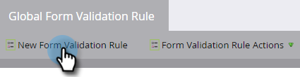

# Regole di convalida modulo globale {#global-form-validation-rules}

Questa funzione consente di bloccare l’invio di domini specifici ai moduli del Marketo Engage.

## Come abilitare l’accesso {#how-to-enable-access}

Prima di poter utilizzare questa funzione, devi abilitarne l’autorizzazione per il ruolo desiderato.

1. In Marketo, fai clic su **[!UICONTROL Amministratore]**.

   

1. Clic **[!UICONTROL Utenti e ruoli]**.

   

1. Fai clic su **[!UICONTROL Ruoli]** scheda.

   

1. Fare doppio clic sul ruolo a cui si desidera concedere le autorizzazioni.

   

1. Fai clic su **+** Accedi ad Access Admin.

   

1. Scorri verso il basso e seleziona **[!UICONTROL Regole di convalida modulo di accesso]** e fai clic su **[!UICONTROL Salva]**.

   

## Crea nuova regola di convalida modulo {#create-new-form-validation-rule}

>[!IMPORTANT]
>
>Queste regole verranno applicate a tutti i moduli delle sottoscrizioni di Marketo Engage.

1. In Marketo, fai clic su **[!UICONTROL Amministratore]**.

   

1. Clic **[!UICONTROL Regola di convalida modulo globale]**.

   

1. Clic **[!UICONTROL Nuova regola di convalida modulo]**.

   

   >[!NOTE]
   >
   >Il menu a discesa Azioni regola di convalida modulo consente di eliminare o modificare le regole esistenti.

1. Assegna un nome alla regola, fornisci una descrizione facoltativa e inserisci il messaggio di errore che desideri venga visualizzato dai visitatori del modulo. Immetti i domini da bloccare nella casella delle regole, seleziona **[!UICONTROL Attiva regola]** e fai clic su **[!UICONTROL Crea]**.

   

>[!NOTE]
>
>Il Marketo Engage dispone di un elenco Bloccati definito di domini e-mail consumer gratuiti che vengono bloccati quando si utilizza la regola di Elenco Bloccati del dominio e-mail consumer pre-caricata &quot;Dominio e-mail consumer:&quot;. [Visualizza l&#39;elenco](/help/marketo/product-docs/administration/settings/assets/freemaildomains.csv).

## Disattivazione dell&#39;accesso per modulo{#how-to-disable-access-per-form}

Una volta abilitate, le regole vengono applicate a tutti i moduli. Se tuttavia si dispone di un modulo con requisiti specifici e non si desidera che venga rifiutato alcun elemento, è possibile disattivare [!UICONTROL Regole di convalida modulo globale] nelle impostazioni del modulo.

1. Nel modulo desiderato, fai clic su **[!UICONTROL Impostazioni modulo]**, quindi **[!UICONTROL Impostazioni]**.

   

1. Fai clic su **[!UICONTROL Regole di convalida modulo globale]** e scegliere **[!UICONTROL Disabilitato]**.

   

Quando approvi e pubblichi il modulo, questo ignorerà il tuo [!UICONTROL Regole di convalida modulo globale].
