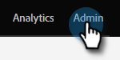

# Intestazioni pagina di destinazione {#landing-page-headers}

Segui i passaggi riportati di seguito per personalizzare alcune delle intestazioni HTTP sui domini della pagina di destinazione.

1. In Marketo, fai clic su **Amministratore**.

   

1. Fai clic su **Pagine di destinazione**.

   

1. Fai clic su **Modifica** accanto a Intestazioni HTTP della pagina di destinazione.

   

1. Scegli le impostazioni desiderate e fai clic su **Salva** al termine.

   

<table>
 <tr>
  <td><strong>Strict-Transport-Security</strong></td>
  <td>Utilizza questo per garantire che le connessioni alle pagine di destinazione vengano sempre servite tramite HTTPS (deve essere impostato solo per gli abbonamenti con pagine di destinazione protette da SSL)</td>
 </tr>
 <tr>
  <td><strong>Opzioni X-Frame</strong></td>
  <td>Consente di definire se le risorse ospitate dal Marketo Engage possono essere incorporate o meno in pagine web esterne</td>
 </tr>
</table>

>[!CAUTION]
>
>È importante esaminare queste impostazioni con il team IT per determinare a cosa devono essere impostati i criteri aziendali. Le impostazioni errate possono impedire ad alcuni visitatori di accedere alle pagine di destinazione.
