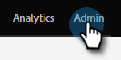
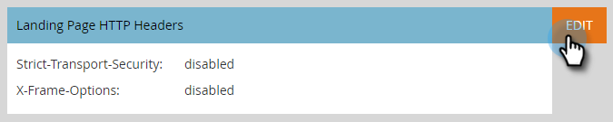
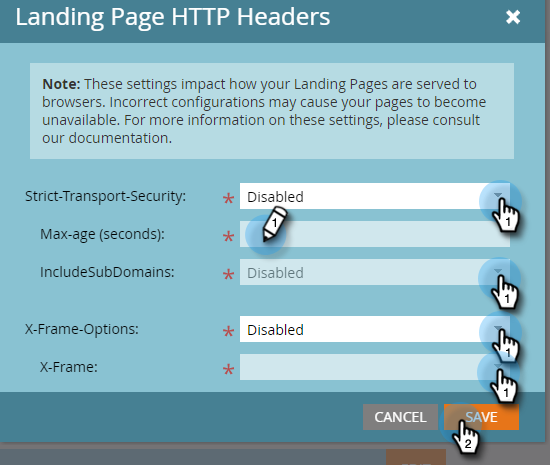

# Intestazioni pagina di destinazione {#landing-page-headers}

Segui i passaggi seguenti per personalizzare alcune delle intestazioni HTTP nei domini della pagina di destinazione.

1. In Marketo, fare clic su **[!UICONTROL Admin]**.

   

1. Fai clic su **[!UICONTROL Landing Pages]**.

   

1. Fare clic su **[!UICONTROL Edit]** accanto a Intestazioni HTTP della pagina di destinazione.

   

1. Scegli le impostazioni desiderate e al termine fai clic su **[!UICONTROL Save]**.

   

<table>
 <tr>
  <td><strong>[!UICONTROL Strict-Transport-Security]</strong></td>
  <td>Utilizzalo per garantire che le connessioni alle pagine di destinazione vengano sempre servite tramite HTTPS (deve essere impostato solo per gli abbonamenti con pagine di destinazione protette da SSL)</td>
 </tr>
 <tr>
  <td><strong>[!UICONTROL X-Frame-Options]</strong></td>
  <td>Consente di definire se le risorse in hosting Marketo Engage possono essere incorporate o meno in pagine web esterne</td>
 </tr>
</table>

>[!CAUTION]
>
>È importante rivedere queste impostazioni con il team IT per determinare su cosa devono essere impostati i criteri della tua organizzazione. Impostazioni errate possono impedire ad alcuni visitatori di accedere alle pagine di destinazione.
