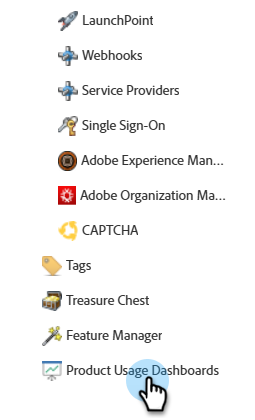

# Dashboard di utilizzo del prodotto {#product-usage-dashboards}

I dashboard di utilizzo dei prodotti Marketo Engage consentono di visualizzare l’utilizzo di prodotti e piattaforme in relazione a determinati limiti o backlog di dati, flussi di dati, utilizzo rispetto alle quote giornaliere e metriche chiave nell’abbonamento. L&#39;infrastruttura viene allocata per fornire i limiti di prestazioni definiti per i livelli di prodotto per attributi specifici. Alcuni di questi limiti, come l’utilizzo dell’API, sono limiti contrattuali acquistati come parte del pacchetto o del livello di prodotto.

## Come accedere {#how-to-access}

1. In Marketo Engage, fai clic su **Amministratore**.

   

1. Nella struttura a sinistra, scorri verso il basso e seleziona **Dashboard di utilizzo del prodotto**.

   

## Dashboard utilizzo attività {#activity-usage-dashboard}

### Attività settimanali medie {#average-weekly-activities}

Il dashboard Utilizzo attività settimanale fornisce un conteggio settimanale dei tipi di attività in un periodo continuo di 52 settimane. Le attività settimanali prodotte sono un buon indicatore della quantità di marketing che si sta facendo in Marketo Engage. Le attività fungono da proxy per i vari processi di sistema e gli eventi tracciabili che si svolgono all’interno di Marketo.

I tipi di attività includono sia i conteggi delle attività acquisite quando persone/lead interagiscono con eventi di marketing, sia le attività basate sul sistema attivate dalle azioni di flusso. Alcuni esempi di attività avviate da una persona si verificano quando un destinatario apre un’e-mail che hai inviato o fa clic su un collegamento in un’e-mail. Un esempio di attività basata sul sistema attivata da un&#39;azione di flusso è _Invia a SFDC_ all&#39;avvio del trigger.

>[!TIP]
>
>Per visualizzare un conteggio dei tipi di attività per una settimana particolare, passa il cursore del mouse sulla settimana desiderata e viene visualizzato il conteggio.

#### Domande frequenti {#faq}

**Quali tipi di attività vengono conteggiati?**

Dipende dalle attività incluse nella pipeline.

**L&#39;attività della persona/lead nota e anonima è inclusa?**

Solo persone/lead noti.

**Con quale frequenza vengono aggiornati i dati?**

I conteggi delle attività vengono aggiornati ogni mattina.

## Raggruppamento attività {#activity-breakdown}

Questa sezione fornisce i conteggi delle attività dei sette giorni precedenti in base a sezioni significative dei dati. Raggruppa le attività in base ai tipi di attività più comuni osservati negli ultimi sette giorni. Questo può includere categorie come _Modifica valore dati_, _Aggiungi all&#39;elenco_ o _Invia e-mail_. Questo consente di vedere quali tipi di attività si verificano più spesso nel sistema. L’utilizzo del tipo di attività è un indicatore chiave per determinare la crescita o se sono necessarie ottimizzazioni per ridurre l’utilizzo.

>[!NOTE]
>
>* Tutte le suddivisioni seguenti sono una somma continua di sette giorni e **non** includono il giorno corrente. Consideralo come &quot;ieri + sei giorni prima&quot;.
>
>* Il dashboard mostra solo i primi 20 tipi di attività, mentre gli altri sono ordinati in una categoria denominata &quot;Altro&quot;.

L’utilizzo delle attività mostra la quantità di marketing condotto e aiuta a visualizzare la crescita rispetto al livello di prodotto per il quale è stato identificato il contratto. Le dashboard possono essere utilizzate anche come guida per determinare il livello di ottimizzazione che può o deve essere eseguito riducendo i campi da aggiornare.

### Per tipo {#by-type}

Raggruppa le attività in base ai tipi di attività più comuni osservati negli ultimi sette giorni. Questo può includere categorie come _Modifica valore dati_, _Aggiungi all&#39;elenco_ o _Invia e-mail_. Questo consente di vedere quali tipi di attività si verificano più spesso nel tuo account Marketo Engage.

### Per modifica attributo valore dati {#by-change-data-value-attribute}

_Modifica valore dati_ è il tipo di attività più comune. Indica quando vengono aggiornate le informazioni di un record persona/lead. Raggruppa in base ai campi che vengono modificati più spesso per determinare quali informazioni sono utili per le operazioni di marketing e se esistono opportunità per ottimizzare l’utilizzo della piattaforma.

### Per campagna {#by-campaign}

Gruppo in base al quale le campagne producono il maggior numero di attività. Questo ti consente di verificare se disponi di campagne particolarmente &quot;rumorose&quot; che creano più attività del necessario. Scopri le campagne che devono essere disattivate o quelle che fanno più lavoro di quanto previsto.
