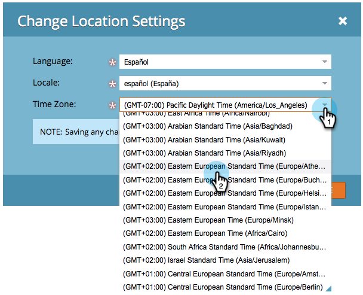

# Seleziona la lingua, la lingua e il fuso orario {#select-your-language-locale-and-time-zone}

L&#39;inglese non è la tua lingua madre? Non preoccuparti, ti abbiamo coperto. Ecco come modificare la lingua, le impostazioni locali e il fuso orario.

## Lingue supportate {#supported-languages}

* Inglese
* Francese
* Tedesco
* Giapponese
* Portoghese
* Spagnolo

## Modifica lingua utente, lingua e fuso orario {#change-user-language-locale-and-time-zone}

1. Vai a **[!UICONTROL Amministratore]** area.

   

1. Seleziona **[!UICONTROL Il mio account]**.

   

1. In Il mio account, fai clic su **[!UICONTROL Modifica impostazioni posizione]**.

   

1. Cambia **[!UICONTROL Lingua]**.

   

   >[!TIP]
   >
   >Puoi anche cambiare solo la tua lingua facendo clic sul menu a discesa della lingua nella parte superiore della pagina di accesso.

1. Cambia **[!UICONTROL Lingua]**.

   

1. Cambia **[!UICONTROL Fuso orario]**.

   

1. Clic **[!UICONTROL Salva]**.

   

Bel lavoro! Il browser si aggiornerà e dovresti vedere le modifiche riflesse.

