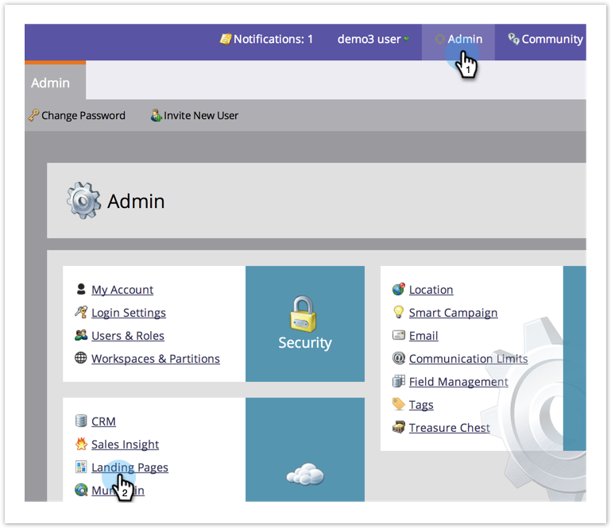

# Imposta una pagina di fallback {#set-a-fallback-page}

Le pagine di fallback sono l’ultima riga di difesa se la pagina di destinazione è offline o non è stata trovata. Assicurati di averne uno.

>[!NOTE]
>
>**Autorizzazioni amministratore richieste**

1. In **Amministratore**, fai clic su **Pagine di destinazione**.

   

1. Nella scheda **Pagine di destinazione**, fai clic su **Modifica**.

   

1. Immetti una **Pagina di fallback** nella finestra di dialogo e fai clic su **Salva**.

   

Voilà! Hai appena aggiunto una pagina di fallback! Non più di 404 pagine.
