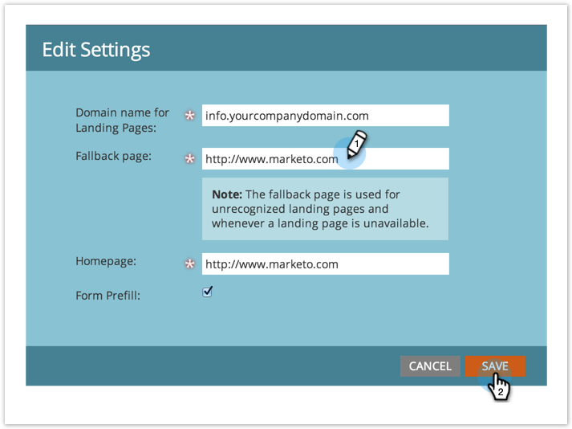

# Impostare una pagina di fallback {#set-a-fallback-page}

Le pagine di fallback rappresentano l’ultima linea di difesa se la pagina di destinazione è offline o non viene trovata. Assicurati di averne uno.

>[!NOTE]
>
>**Autorizzazioni amministratore richieste**

1. Vai a **[!UICONTROL Amministratore]** area.

   

1. Clic **[!UICONTROL Pagine di destinazione]**.

   

1. Sotto **[!UICONTROL Pagine di destinazione]** , fare clic su **[!UICONTROL Modifica]**.

   

1. Immetti un **[!UICONTROL Pagina di fallback]** nella finestra di dialogo e fai clic su **[!UICONTROL Salva]**.

   

