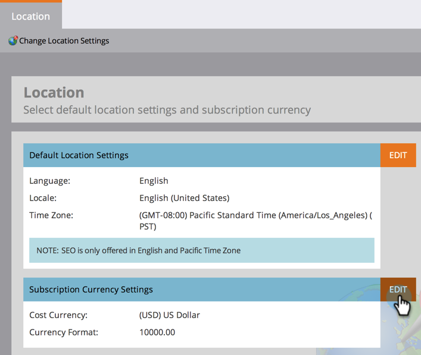

# Imposta la valuta predefinita {#set-default-currency}

Scopri come visualizzare e modificare la valuta predefinita per l’abbonamento a Marketo Engage.

>[!NOTE]
>
>**Autorizzazioni amministratore richieste.**

1. Passa alla schermata **[!UICONTROL Admin]**.

   

1. Fai clic su **[!UICONTROL Location]**.

   

1. Fare clic su **[!UICONTROL Edit]** in [!UICONTROL Subscription Currency Settings].

   

1. Selezionare il formato valuta desiderato e fare clic su **[!UICONTROL Save]**.

   
