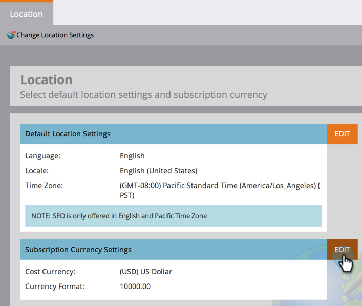

# Imposta le impostazioni di posizione predefinite per una sottoscrizione {#set-default-location-settings-for-a-subscription}

Questo articolo descrive come un amministratore visualizza e modifica le impostazioni di posizione predefinite per una sottoscrizione, incluse la lingua, le impostazioni internazionali e il fuso orario.

>[!NOTE]
>
>Sono richiesti i diritti di amministratore. In genere, la lingua non è qualcosa che l’amministratore cambierebbe. Viene specificato al momento dell’acquisto in modo che l’abbonamento possa essere generato nella lingua appropriata.

## Imposta le impostazioni di posizione predefinite per una sottoscrizione {#set-default-location-settings-for-a-subscription-1}

Quando un amministratore modifica le impostazioni di posizione predefinite, i nuovi utenti creati ereditano queste impostazioni. Gli utenti possono sempre [modifica delle preferenze relative a lingua, impostazioni internazionali e fuso orario](/help/marketo/product-docs/administration/settings/select-your-language-locale-and-time-zone.md) nei loro conti individuali.

1. Vai a **Amministratore** area.

   

1. Fai clic su **Posizione**.

   

1. Fai clic su **Modifica**.

   

   Questo abbonamento è stato creato in inglese. Supponiamo che tu sia a Londra e desideri cambiare le impostazioni internazionali e il fuso orario predefiniti. Le impostazioni internazionali determinano la formattazione di numeri, date e ore.

1. Seleziona la **Impostazioni internazionali** e cambiarlo in **Inglese** (Regno Unito).

   

1. Infine, scegli il **Fuso orario**.

   

   >[!NOTE]
   >
   >Marketo Sales Insight per [Salesforce.com](https://salesforce.com/) supporta francese, tedesco, giapponese, portoghese e spagnolo.

## Imposta le impostazioni della valuta predefinita per una sottoscrizione {#set-the-default-currency-settings-for-a-subscription}

Se si modificano le impostazioni internazionali predefinite per gli utenti, è possibile modificare anche le impostazioni del formato della valuta.

1. Fai clic su **Modifica** in Impostazioni valuta sottoscrizione.

   

1. Selezionare il formato di valuta desiderato e fare clic su **Salva**.

   

   Complimenti. Hai modificato le impostazioni di posizione per l’abbonamento.

>[!MORELIKETHIS]
>
>* [Selezionare la lingua, le impostazioni internazionali e il fuso orario](/help/marketo/product-docs/administration/settings/select-your-language-locale-and-time-zone.md)

