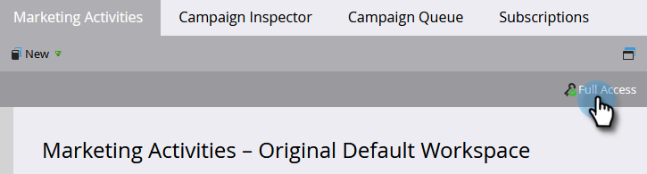

# Scopri quali autorizzazioni possiedi {#find-out-what-permissions-you-have}

Se ti stai chiedendo quali autorizzazioni hai o non hai in Marketo, c&#39;è un modo semplice per scoprirlo.

1. Passa a **[!UICONTROL Marketing Activities]**.

   

1. Fai clic su **[!UICONTROL Full Access]** per visualizzare le autorizzazioni di cui disponi.

   

Vedrai le autorizzazioni elencate.

Se hai bisogno di una delle autorizzazioni abilitate, rivolgiti al tuo amministratore Marketo.
