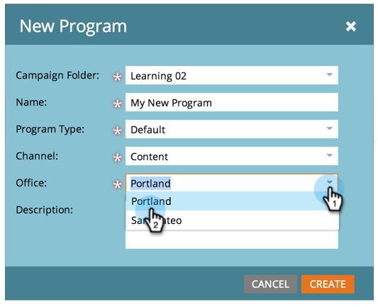

# Creare un nuovo tag e nuovi valori tag del programma {#create-a-new-program-tag-and-tag-values}

>[!NOTE]
>
>**Autorizzazioni amministratore richieste**

Potete creare [tag](../../../product-docs/core-marketo-concepts/programs/working-with-programs/understanding-tags.md) personalizzati per i programmi e assegnare valori al tag.

>[!NOTE]
>
>**Esempio**
>
>Tag programma: Destinatari Target
>
>Valore tag programma: SMB, Enterprise, Media Market

1. In **Admin**, fai clic su **Tag**.

   

1. Fate clic su **Nuovo** e selezionate **Nuovo tipo** di tag.

   

1. Inserite il tipo **di** tag e un **valore** di tag. Quindi fate clic su **Aggiungi un altro**.

   

1. Immettete tutti i valori necessari. Selezionare i tipi di programma a cui applicare il tag.

   

   >[!TIP]
   >
   >È possibile selezionare più tipi di programmi. Quando viene creato un nuovo programma, questo tipo di tag sarà disponibile.

1. Selezionate **Obbligatorio** e fate clic su **Crea**.

   

   >[!NOTE]
   >
   >Se il tipo di tag è **Obbligatorio**, gli utenti dovranno immettere un valore per il tag durante la creazione di un nuovo programma.

   

Ora, quando gli utenti creano un programma, devono impostare il valore personalizzato per il tag creato.