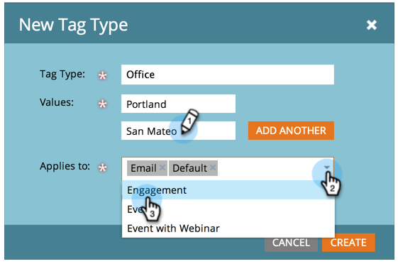

# Creare un nuovo tag programma e valori di tag {#create-a-new-program-tag-and-tag-values}

>[!NOTE]
>
>**Autorizzazioni amministratore richieste**

Puoi creare [tag](/help/marketo/product-docs/core-marketo-concepts/programs/working-with-programs/understanding-tags.md) personalizzati per i programmi e assegnare valori al tag.

>[!NOTE]
>
>**Esempio**
>
>Tag programma: Target Audience
>
>Valore del tag del programma: PMI, azienda, mercato intermedio

1. Passa alla schermata **[!UICONTROL Admin]**.

   

1. Fai clic su **[!UICONTROL Tags]**.

   

1. Fare clic su **[!UICONTROL New]** e selezionare **[!UICONTROL New Tag Type]**.

   

1. Immettere **[!UICONTROL Tag Type]** e un tag **[!UICONTROL Value]**. Quindi fai clic su **[!UICONTROL Add Another]**.

   

1. Inserire tutti i valori necessari. Seleziona i tipi di programma a cui applicare il tag.

   

   >[!TIP]
   >
   >È possibile selezionare più tipi di programmi. Quando viene creato un nuovo programma, questo tipo di tag sarà disponibile.

1. Selezionare **[!UICONTROL Required]** e fare clic su **[!UICONTROL Create]**.

   

   >[!NOTE]
   >
   >Se il tipo di tag è **[!UICONTROL Required]**, gli utenti dovranno immettere un valore per il tag durante la creazione di un nuovo programma.

   

Ora, quando gli utenti creano un programma, devono impostare il valore personalizzato per il tag creato.
