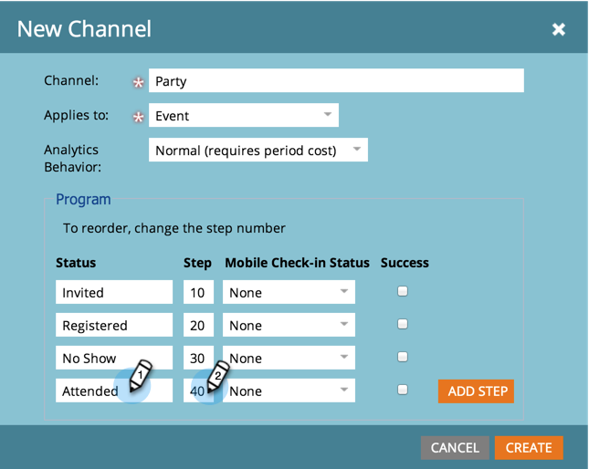

# Creare un canale di programma {#create-a-program-channel}

Un programma è una specifica iniziativa di marketing. Il canale deve essere il meccanismo di consegna, come Webinar o Sponsorship o Online Ad.

>[!NOTE]
>
>**Autorizzazioni amministratore richieste**

>[!NOTE]
>
>Scopri di più su [programs](/help/marketo/product-docs/core-marketo-concepts/programs/creating-programs/understanding-programs.md), l&#39;elemento più importante di Marketo.

1. Nella sezione **Admin**, fare clic su **Tags**.

   

   >[!NOTE]
   >
   >Perché i tag? Un canale è un modo per descrivere un programma, proprio come altri tag. Il canale dispone di particolari funzioni aggiuntive.

1. Fare clic sul segno **+** accanto a **Canale** per espandere e visualizzare i canali esistenti.

   

1. In **New**, fare clic su **New Channel**.

   

   >[!NOTE]
   >
   >**Esempio**
   >
   >Canale: Billboard
   >
   >* Applica a: Predefinito
   >* Progressione: Membro, Coinvolto (in caso di dubbio, questi lavori vanno bene)
   >* Successo: Coinvolto

   >
   >Canale: Party
   >
   >* Applica a: Evento
   >* Progressione: Invitati, registrati, No Show e Partecipanti
   >* Successo: Partecipante

   >
   >Scopri le Progressioni dei canali esistenti per avere un&#39;idea di come utilizzarli.

1. Passiamo all&#39;esempio del canale del Partito. Assegnare un nome al nuovo **Canale** e selezionare il tipo di programma a cui si applicherà.

   

   >[!NOTE]
   >
   >Applicare a cosa? Esistono diversi tipi di programmi. Corrispondenza del canale con il tipo di canale destro. In caso di dubbio, scegliere **Predefinito**.

   >[!NOTE]
   >
   >Quando si utilizza &quot;Evento con webinar&quot;, le mappature del sistema verranno bloccate (come richiesto dalle integrazioni del webinar) e non potranno essere modificate.

   Inserire i primi due nomi di stato del programma, quindi fare clic su Aggiungi passo.
   

1. Inserire un altro programma **Stato** e **Numero passo**, quindi fare clic su **Aggiungi passo**.

   

   >[!TIP]
   >
   >Il numero **Step** viene utilizzato per ordinare gli stati del programma. Ricordate che le persone non possono andare indietro in questi passi di progressione. Possono solo cambiare lo stato in uno stato di valore superiore o uguale. Utilizzate i valori uguali quando gli stati sono destinati a passare avanti e indietro anziché a una progressione.

1. Inserire l&#39;ultimo programma **Stato** e il numero **Passo**.

   

   >[!NOTE]
   >
   >Quando si utilizza il tipo &quot;Evento&quot;, è necessaria la mappatura di sistema per gli stati Registrato, In lista d&#39;attesa e Partecipato. Di conseguenza, tali stati non possono essere nascosti.

1. Selezionare il **Stato del check-in mobile** per **Registrato**.

   

1. Selezionare il **Stato del check-in mobile** per **Partecipato**.

   

   >[!NOTE]
   >
   >**Le opzioni Stato** del check-in mobile** **saranno disponibili solo se il canale sarà per i programmi dell&#39;evento.

   >[!NOTE]
   >
   >Nelle [app di check-in mobili **solo le persone con uno stato di** archiviazione mobile **Registrato** e **Partecipato** saranno visibili.](/help/marketo/product-docs/core-marketo-concepts/mobile-apps/event-check-in/event-check-in-overview.md)

   >[!TIP]
   >
   >Se una nuova persona viene creata nell&#39;app di check-in per dispositivi mobili, verrà impostata su Registrata nel programma dell&#39;evento. Se una persona viene selezionata nell&#39;evento nell&#39;app, viene impostata su Partecipante nel programma dell&#39;evento.

1. Selezionare lo stato del programma **Success**, quindi fare clic su **Create**.

   

   Ben fatto! Quando si crea un nuovo programma di quel tipo, questo nuovo canale sarà una delle scelte.
