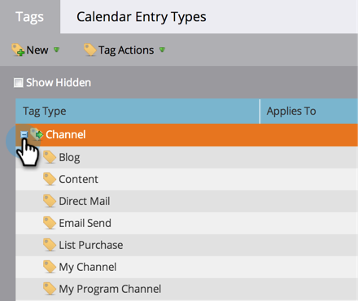

# Creare un canale del programma {#create-a-program-channel}

Un programma è una specifica iniziativa di marketing. Il canale deve essere il meccanismo di consegna, ad esempio Webinar o Sponsorship o Online Ad.

>[!NOTE]
>
>**Autorizzazioni amministratore richieste**

>[!NOTE]
>
>Ulteriori informazioni [programmi](/help/marketo/product-docs/core-marketo-concepts/programs/creating-programs/understanding-programs.md), l’elemento più importante in Marketo.

1. Vai a **Amministratore** area.

   

1. Fai clic su **Tag**.

   

   >[!NOTE]
   >
   >Perché i tag? Un canale è un modo per descrivere un programma, proprio come altri tag. Il canale dispone di caratteristiche extra speciali.

1. Fai clic sul pulsante **+** firma accanto a **Canale** per espandere e visualizzare i canali esistenti.

   

1. Sotto **Nuovo**, fai clic su **Nuovo canale**.

   

   >[!NOTE]
   >
   >**Esempio**
   >
   >Canale: Billboard
   >
   >* Applica a: Predefinito
   >* Progressione: Membro, impegnato (in caso di dubbio, questi funzionano bene)
   >* Operazione riuscita: Coinvolto

   >
   >Canale: Partito
   >
   >* Applica a: Evento
   >* Progressione: Invitati, registrati, non mostrati e presenti
   >* Operazione riuscita: Partecipato

   >
   >Consulta Progressioni dei canali esistenti per avere un&#39;idea di come usarli.

1. Passiamo all&#39;esempio del canale Party. Dai un nome al nuovo **Canale** e selezionare il tipo di programma a cui si applica.

   

   >[!NOTE]
   >
   >Applicare a cosa? Ci sono diversi tipi di programmi. Fai corrispondere il canale al tipo giusto. In caso di dubbio, scegli **Predefinito**.

   >[!NOTE]
   >
   >Quando utilizzi &quot;Event with Webinar&quot;, le mappature di sistema saranno bloccate (come richiesto dalle integrazioni dei webinar) e non possono essere modificate.

1. Immettere i primi due nomi di stato del programma, quindi fare clic su **Aggiungi passaggio**.

   

1. Inserisci un altro programma **Stato** e **Passaggio** numero, quindi fare clic su **Aggiungi passaggio**.

   

   >[!TIP]
   >
   >La **Passaggio** viene utilizzato per ordinare gli stati del programma. Tenete presente che le persone non possono andare indietro in questi passaggi progressivi. Possono solo cambiare lo stato in uno stato di valore superiore o uguale. Utilizza i valori uguali quando gli stati sono destinati a cambiare avanti e indietro rispetto a una progressione.

1. Inserire l&#39;ultimo programma **Stato** e **Passaggio** numero.

   

   >[!NOTE]
   >
   >Quando si utilizza il tipo &quot;Evento&quot;, è necessario eseguire la mappatura del sistema per gli stati Registrato, In attesa e Allegato. Di conseguenza, tali stati non possono essere nascosti.

1. Scegli la **Stato del check-in per dispositivi mobili** per **Registrato**.

   

1. Scegli la **Stato del check-in per dispositivi mobili** per **Partecipato**.

   

   >[!NOTE]
   >
   >**Stato del check-in per dispositivi mobili**** **le opzioni sono disponibili solo se il canale è per i programmi evento.

   >[!NOTE]
   >
   >Solo persone con un **Stato del check-in per dispositivi mobili** di **Registrato** e **Partecipato** sarà visibile nella [App per il check-in di dispositivi mobili](/help/marketo/product-docs/core-marketo-concepts/mobile-apps/event-check-in/event-check-in-overview.md).

   >[!TIP]
   >
   >Se nell’app di accesso mobile viene creata una nuova persona, questa verrà impostata su Registrata nel programma dell’evento. Se una persona viene archiviata nell&#39;evento nell&#39;app, verrà impostata su Partecipante nel programma dell&#39;evento.

1. Seleziona la **Completato** stato del programma, quindi fare clic su **Crea**.

   

   Ben fatto! Quando si effettua un nuovo programma di quel tipo, questo nuovo canale sarà una delle scelte.
