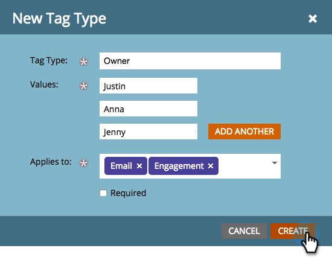

# Creare tag personalizzati {#create-custom-tags}

I tag consentono di organizzare i programmi, mentre i canali facilitano la raccolta dei dati a scopo di reporting.

>[!NOTE]
>
>Per ulteriori informazioni, consulta [Informazioni sui tag](/help/marketo/product-docs/core-marketo-concepts/programs/working-with-programs/understanding-tags.md) .

>[!NOTE]
>
>**Autorizzazioni amministratore richieste**

## Creare un nuovo tipo di tag {#create-a-new-tag-type}

Per creare un nuovo tipo di tag:

1. Vai alla sezione **Amministratore** .

   

1. Fare clic su **Tag**.

   

1. Fare clic su **Nuovo** e selezionare **Nuovo tipo di tag.**

   

1. Immetti un nome per il **Tipo di tag**.

   

1. Inserisci il **Valore** desiderato per il tipo di tag. Fai clic su **Aggiungi un altro** per inserire valori di tag aggiuntivi.

   

1. Seleziona a quali programmi si applica questo tag.

   

   >[!NOTE]
   >
   >Selezionare **Obbligatorio per tutti i programmi** per aggiungere questo tag ogni volta che viene creato un nuovo programma.

1. Fai clic su **Crea** per salvare.

   

   Tutto qui! Ora è possibile creare tag personalizzati per i programmi.
