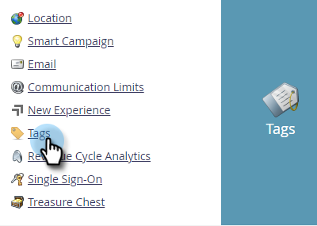
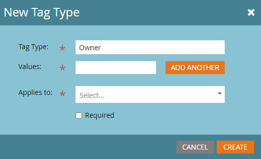
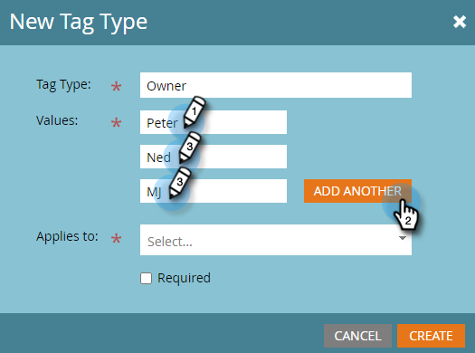
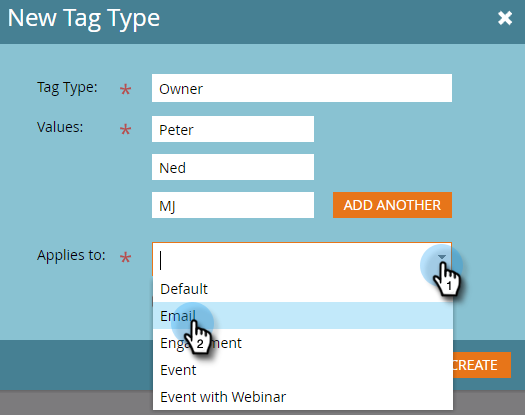
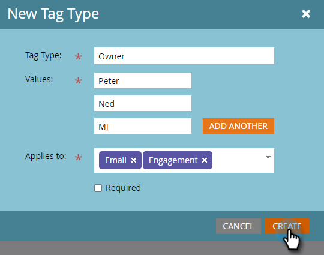

# Creare tag personalizzati {#create-custom-tags}

I tag ti aiuteranno a organizzare i programmi, mentre i canali ti aiuteranno a raccogliere dati a scopo di reporting.

>[!NOTE]
>
>Per ulteriori informazioni, vedere [Informazioni sui tag](/help/marketo/product-docs/core-marketo-concepts/programs/working-with-programs/understanding-tags.md).

>[!NOTE]
>
>**Autorizzazioni amministratore richieste**

## Crea un nuovo tipo di tag {#create-a-new-tag-type}

Per creare un nuovo tipo di tag:

1. Passare alla sezione **[!UICONTROL Admin]**.

   

1. Fai clic su **[!UICONTROL Tags]**.

   

1. Fare clic su **[!UICONTROL New]** e selezionare **[!UICONTROL New Tag Type]**.

   

1. Immettete un nome per il tipo di tag.

   

1. Immetti il valore desiderato per il tipo di tag. Fare clic su **[!UICONTROL Add Another]** per immettere valori aggiuntivi.

   

1. Seleziona i tipi di programma a cui si applica questo tag.

   

1. Decidi se rendere obbligatorio o meno questo tag per tutti i tipi di programmi elencati.

   

   >[!NOTE]
   >
   >* Selezionare &quot;[!UICONTROL Required]&quot; se si desidera aggiungere questo tag ogni volta che viene creato un nuovo programma.
   >* Se si rimuove un tipo di programma dall&#39;elenco &#39;[!UICONTROL Applies to]&#39;, il tag e i relativi valori verranno eliminati da tutti i programmi esistenti di quel tipo. Se si desidera mantenere i valori dei tag esistenti e rendere facoltativo il tag in futuro per _tutti_ i tipi di programma elencati, lasciare deselezionata la casella di controllo &quot;Obbligatorio&quot;.

   >[!TIP]
   >
   >Se si desidera rendere un tag simile necessario per alcuni tipi di programmi, ma facoltativo per altri, sarà necessario impostare due tag separati, ciascuno applicabile a tipi di programmi diversi con uno con &quot;[!UICONTROL Required]&quot; selezionato e l&#39;altro con &quot;[!UICONTROL Required]&quot; non selezionato.

1. Fai clic su **[!UICONTROL Create]**.

   
