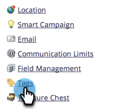
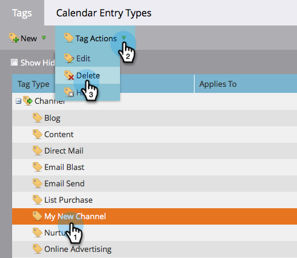

# Eliminare un canale del programma {#delete-a-program-channel}

I canali del programma sono una raccolta di stati o punti di controllo che i lead devono esaminare in un programma.

Se ne effettui una per sbaglio o non ne hai più bisogno, puoi eliminarla.

1. Passa alla schermata **[!UICONTROL Admin]**.

   

1. Fai clic su **[!UICONTROL Tags]**.

   

1. Seleziona il canale da eliminare. Nel menu a discesa **[!UICONTROL Tag Actions]**, fare clic su **[!UICONTROL Delete]**.

   >[!TIP]
   >
   >Se il canale è associato a uno o più programmi, non puoi eliminarlo, ma solo nasconderlo.

   

È inoltre possibile [eliminare stati specifici dai canali](/help/marketo/product-docs/administration/tags/delete-a-program-status-from-a-program-channel.md).
