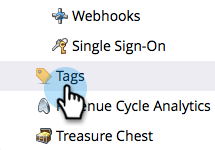

# Eliminare lo stato di un programma da un canale del programma {#delete-a-program-status-from-a-program-channel}

Gli stati dei programmi sono i punti di controllo attraverso un percorso dei programmi (canale). Se per errore crei uno stato o non ne hai più bisogno, puoi eliminarlo.

1. Vai a **[!UICONTROL Amministratore]** area.

   

1. Clic **[!UICONTROL Tag]**.

   

1. Seleziona il canale da cui vuoi rimuovere uno stato, quindi in **[!UICONTROL Azioni tag]**, fai clic su **[!UICONTROL Modifica]**.

   

1. Fai clic sul pulsante rosso **X** per rimuovere lo stato, fai clic su **[!UICONTROL Salva]**.

   

   >[!TIP]
   >
   >Se una persona è attualmente assegnata allo stato in questione, non è possibile eliminarlo, è tuttavia possibile nasconderlo.

Ben fatto! È inoltre possibile [eliminare un intero canale](/help/marketo/product-docs/administration/tags/delete-a-program-channel.md) se è necessario.
