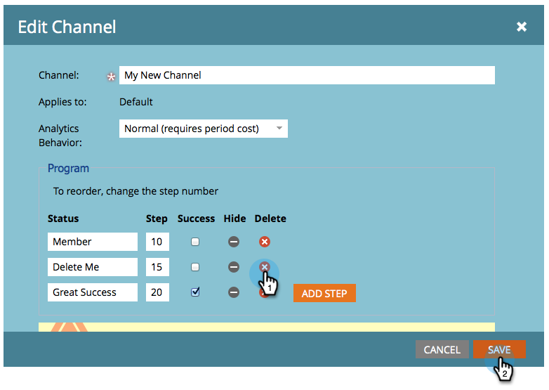

# Eliminare lo stato di un programma da un canale del programma {#delete-a-program-status-from-a-program-channel}

Gli stati dei programmi sono i punti di controllo attraverso un percorso dei programmi (canale). Se per errore crei uno stato o non ne hai più bisogno, puoi eliminarlo.

1. Passa alla schermata **[!UICONTROL Admin]**.

   

1. Fai clic su **[!UICONTROL Tags]**.

   

1. Selezionare il canale da cui si desidera rimuovere uno stato, quindi in **[!UICONTROL Tag Actions]** fare clic su **[!UICONTROL Edit]**.

   

1. Fai clic sul **X** rosso per rimuovere lo stato, quindi fai clic su **[!UICONTROL Save]**.

   

   >[!TIP]
   >
   >Se una persona è attualmente assegnata allo stato in questione, non è possibile eliminarlo, è tuttavia possibile nasconderlo.

Ben fatto! Puoi anche [eliminare un intero canale](/help/marketo/product-docs/administration/tags/delete-a-program-channel.md), se necessario.
