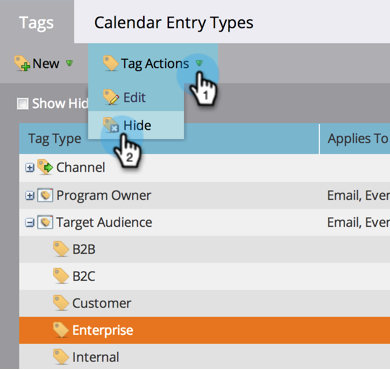

# Gestire i valori tag {#managing-tag-values}

[Tag](/help/marketo/product-docs/core-marketo-concepts/programs/working-with-programs/understanding-tags.md) utilizzati per descrivere i programmi. Puoi crearne quanti ne hai bisogno, ciascuno con valori univoci. Ecco come gestire questi valori.

>[!NOTE]
>
>**Autorizzazioni amministratore richieste**

>[!PREREQUISITES]
>
>[Crea un nuovo tag programma e valori tag](/help/marketo/product-docs/administration/tags/create-a-new-program-tag-and-tag-values.md)

## Aggiunta di valori di tag {#adding-tag-values}

1. Passa alla schermata **[!UICONTROL Admin]**.

   

1. Fai clic su **[!UICONTROL Tags]**.

   

1. Fare clic su **[!UICONTROL New]**, quindi su **[!UICONTROL New Tag Value]**.

   

1. Seleziona **[!UICONTROL Tag Type]**.

   

1. Immettere **[!UICONTROL Value]** e fare clic su **[!UICONTROL Add Another]**. È possibile aggiungere tutti i valori desiderati.

   

1. Aggiungere i valori rimanenti e fare clic su **[!UICONTROL Create]**.

   

Dovresti vedere le modifiche immediatamente!

## Nascondere i valori dei tag {#hiding-tag-values}

I tag potrebbero essere utilizzati da programmi precedenti. Per renderle obsolete e utilizzarle in futuro, nascondi il tipo di tag.

1. Selezionare **[!UICONTROL Tag]** e selezionare **[!UICONTROL Value]** da nascondere.

   

1. In **[!UICONTROL Tag Actions]**, selezionare **[!UICONTROL Hide]**.

   

## Mostra valori nascosti {#show-hidden-values}

Se si desidera visualizzare nuovamente i valori nascosti, eseguire le operazioni seguenti:

1. Selezionare la casella di controllo **[!UICONTROL Show Hidden]**. Una volta selezionata, è possibile visualizzare il valore nascosto.

   

Puoi quindi scoprire i valori che vorresti utilizzare in futuro.
