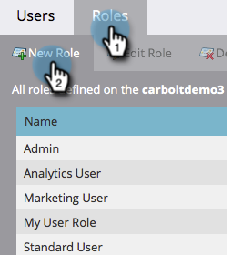

# Creare un ruolo utente solo API {#create-an-api-only-user-role}

Se desideri effettuare l’integrazione con Marketo tramite [API REST](https://developers.marketo.com/documentation/rest/), la best practice consiste nel [assegna a un utente il ruolo Solo API](/help/marketo/product-docs/administration/users-and-roles/create-an-api-only-user.md) e poi [creare un servizio personalizzato da utilizzare con API ReST](/help/marketo/product-docs/administration/additional-integrations/create-a-custom-service-for-use-with-rest-api.md). Di seguito viene descritto come creare il ruolo utente Solo API.

>[!NOTE]
>
>**Autorizzazioni amministratore richieste**

1. Vai a **[!UICONTROL Amministratore]** area.

   

1. Clic **[!UICONTROL Utenti e ruoli]**.

   

1. Fai clic su **[!UICONTROL Ruoli]** e quindi **[!UICONTROL Crea Ruolo]**.

   

1. Inserisci un Nome ruolo, seleziona le Autorizzazioni di accesso API che desideri assegnare e fai clic su **[!UICONTROL Crea]**.

   

>[!TIP]
>
>È sempre consigliabile concedere solo le autorizzazioni minime necessarie.

>[!MORELIKETHIS]
>
>Ok, ben fatto! Ora andiamo [creare un utente solo API](/help/marketo/product-docs/administration/users-and-roles/create-an-api-only-user.md).
